# Assignment 3 — Production Maintenance Drill (OPS Checklist)

Part of the DevOps Micro Internship (DMI) Cohort 3 with Agentic AI

---

## Purpose

In this assignment, you will treat your already deployed React application (on Ubuntu VM with Nginx) as a live production system. You will perform structured operational checks covering network validation, service health, log analysis, resource monitoring, configuration verification, and incident simulation with recovery — mirroring real on-call DevOps responsibilities.

---

# Task 1 — Server Access & Networking Validation

## Goal

Verify that the deployed React application is reachable from the browser and confirm basic network connectivity of the Ubuntu VM.

### Evidence

#### Screenshot 1 — Browser showing the React app with your Full Name visible on the UI

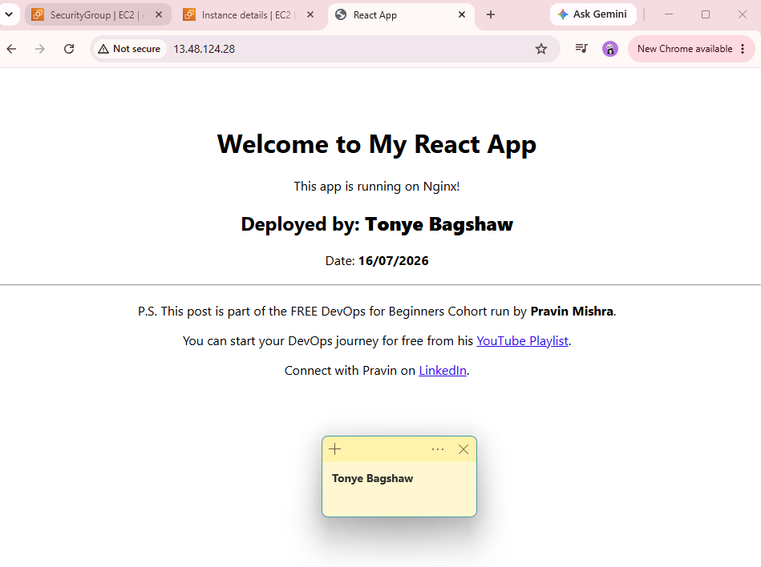

---

#### Screenshot 2 — Output of `ip a`

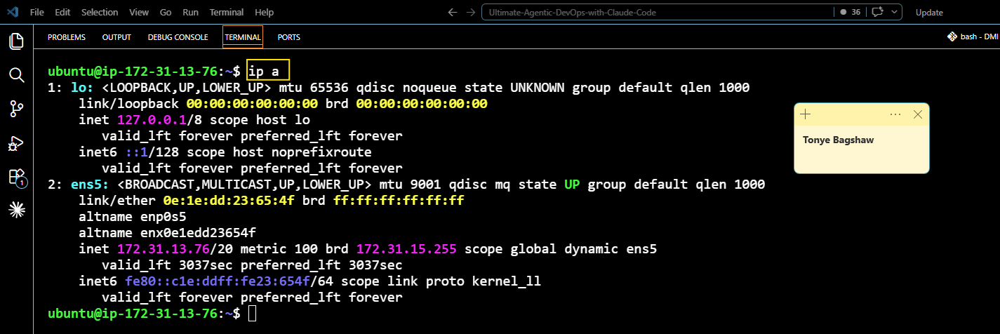

---

#### Screenshot 3 — Output of `sudo ss -tulpen`

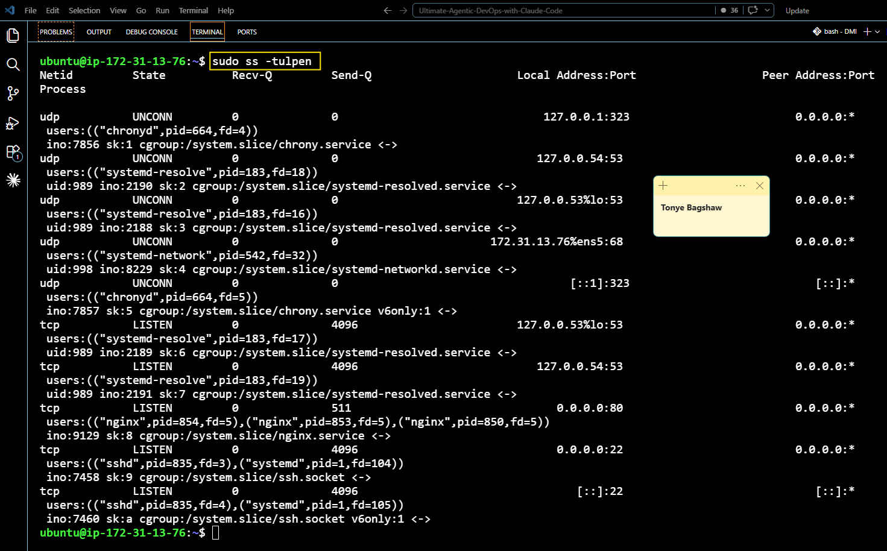

---

#### Screenshot 4 — Output of `sudo ufw status`

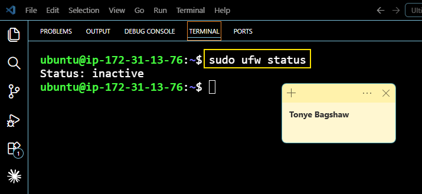

---

### Notes

Answer the following in your own words:

**1. What proves Nginx is listening on 0.0.0.0:80?**

Running sudo ss -tulpen clearly shows that nginx is listening on 0.0.0.0:80 as clearly shown in the below screenshot

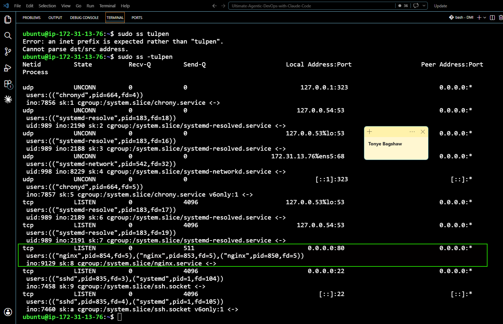

---

**2. What proves SSH is active on port 22?**

Running sudo ss -tulpen also shows that SSH is listening on 0.0.0.0:22 as clearly shown in the below screenshot

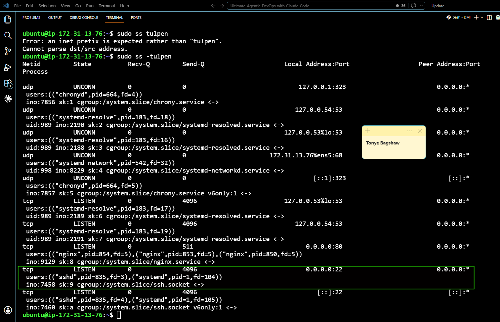

---

**3. Did you find any unexpected open ports? Explain briefly.**

No, I did not find any other open ports as seen in the above two screenshots.

---

# Task 2 — Service Health & Systemd Validation (Nginx)

## Goal

Verify that Nginx is properly installed, running, enabled at boot, and safely configured.

### Evidence

#### Screenshot 1 — Output of `systemctl status nginx --no-pager`

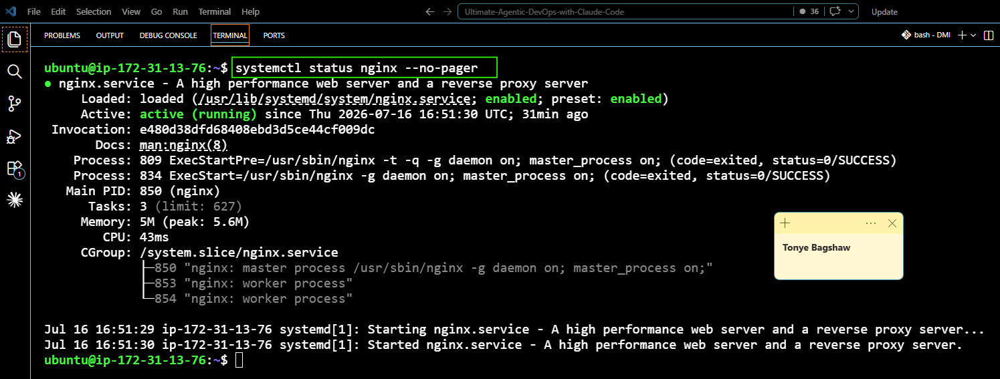

---

#### Screenshot 2 — Output of `sudo nginx -t`

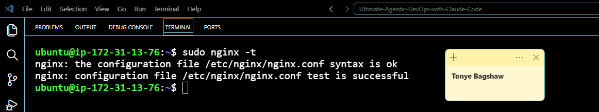

---

#### Screenshot 3 — Output of `sudo ss -lptn '( sport = :80 )'`

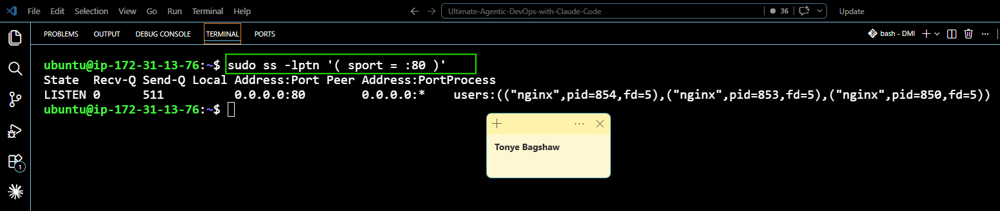

---

### Notes

Answer the following in your own words:

**1. What happens if Nginx fails to restart in production?**

If Nginx fails to restart in production, users won't be able to access the website until the issue is fixed.

---

**2. What's your basic rollback plan?**

My basic rollback plan would be to restore the previous working version of the application, restart Nginx, and test the website to make sure it's working again.

---

# Task 3 — Logs & Request Trace

## Goal

Verify real traffic flow and analyze logs to understand system behavior and errors.

### Evidence

#### Screenshot 1 — Output of `sudo tail -n 30 /var/log/nginx/access.log`

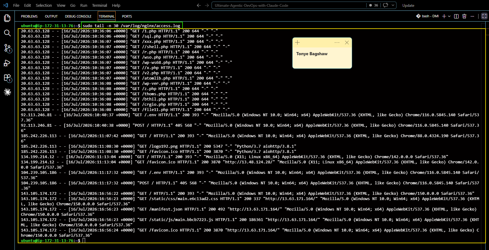

---

#### Screenshot 2 — Output of `sudo tail -n 30 /var/log/nginx/error.log`

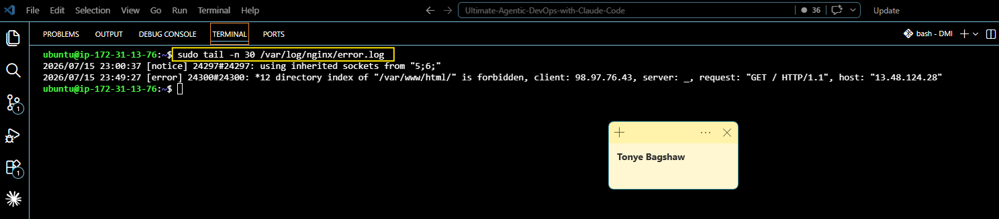

---

#### Screenshot 3 — Output of `sudo journalctl -u nginx --no-pager -n 50`

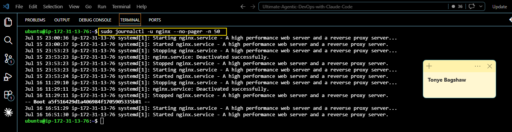

---

### Notes

Answer the following in your own words:

**1. Were there any errors in the logs?**

- If yes, mention 1–2 example error lines from the logs and explain what each one means in simple terms.
- If no, explain what it means if the error log is empty or shows no recent errors during your check.

No. The error log showed no recent errors, which means Nginx was running normally and no problems were detected during the check.

---

**2. If there were no errors, what does that indicate about the system?**

It indicates the web server was healthy, running correctly, and serving requests without any issues.

---

**3. Based on the access logs, were your curl requests visible in the log entries? What does that prove about traffic flow?**

Yes. The curl requests appeared in the access log, proving that the requests reached the Nginx server and were successfully processed.
Write your answer here.

---

# Task 4 — System Resource Health Check (Capacity Red Flags)

## Goal

Assess server capacity and detect potential performance or failure risks.

### Evidence

#### Screenshot 1 — Output of `uptime`

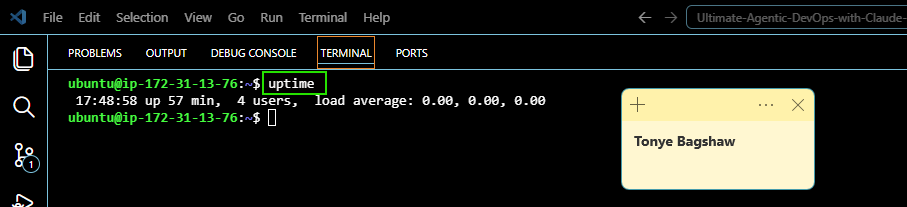

---

#### Screenshot 2 — Output of `free -h`

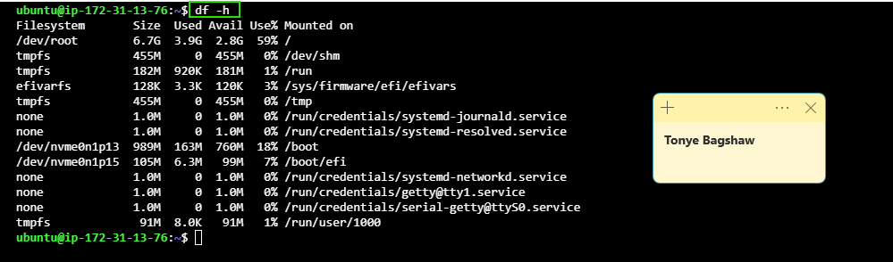

---

#### Screenshot 3 — Output of `df -h`

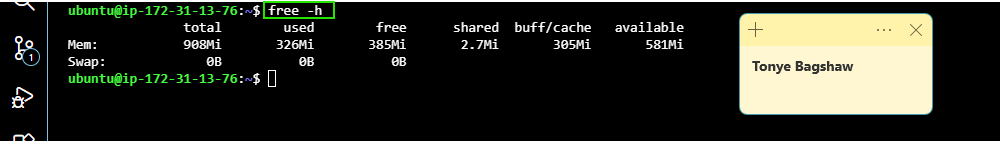

---

#### Screenshot 4 — Output of `sudo du -sh /var/* | sort -h`

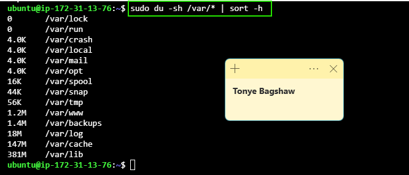

---

### Notes

Answer the following in your own words:

**1. Which resource looks most critical right now? (CPU/load, memory, or disk) Explain why.**

Memory usage looks the most critical cos it is using up 59% of the total space.

---

**2. What happens if disk becomes 100% full in a production server?**

If the disk becomes 100% full, the server may not be able to write new files or logs, applications can fail, and the website or services may stop working until space is freed.

---

# Task 5 — Configuration & Deployment Verification

## Goal

Ensure the correct React build is deployed and Nginx is serving it properly.

### Evidence

#### Screenshot 1 — Output of `ls -lah /var/www/html | head -n 20`

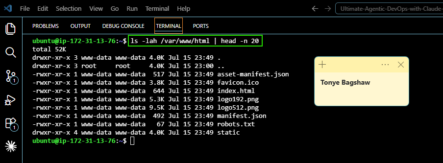

---

#### Screenshot 2 — Output of `grep -R "Deployed by" -n /var/www/html 2>/dev/null | head`

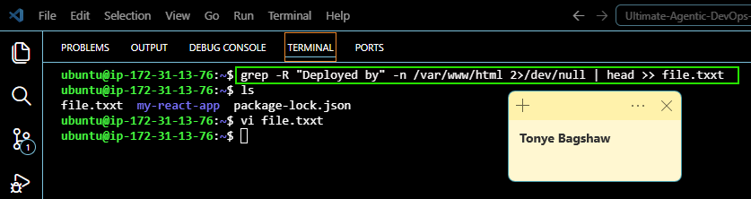

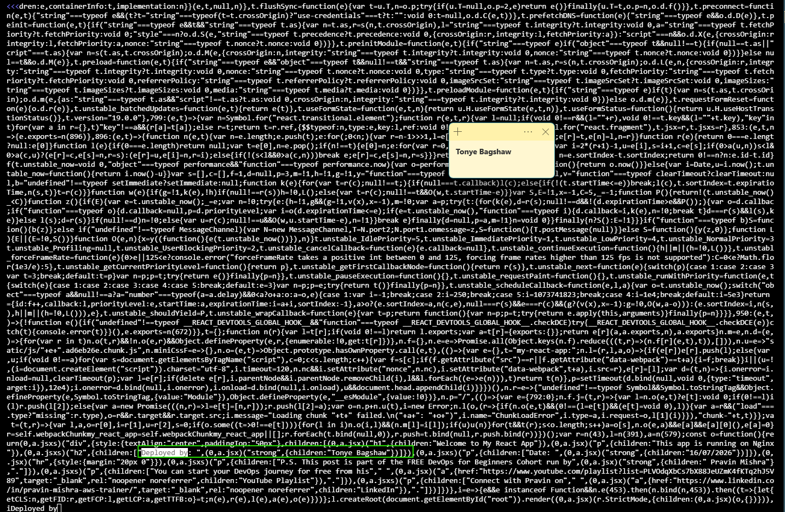

---

#### Screenshot 3 — Output of `grep -n "try_files" /etc/nginx/sites-available/default`

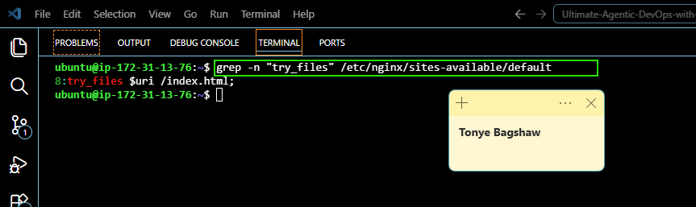 

---

### Notes

Answer the following in your own words:

**1. How do you confirm that the correct version of the application is deployed?**

I confirmed the correct version of the application was deployed by checking the contents of /var/www/html with ls -lah and verifying that the React build files, including index.html and the static folder, were present. I then searched the deployed files and confirmed my custom "Deployed by Tonye Bagshaw" text was included, proving the latest build had been deployed. Finally, I verified that Nginx was serving files from the correct web root (/var/www/html) and opened the application in a web browser to ensure it loaded correctly and displayed the updated version.

---

# Task 6 — Nginx Configuration Failure Simulation

## Goal

Simulate a real-world Nginx misconfiguration and recover the service safely.

### Evidence

#### Screenshot 1 — Output of `sudo nginx -t` showing the syntax error (broken config)

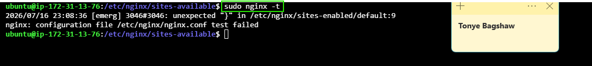

---

#### Screenshot 2 — Output of `sudo nginx -t` showing syntax ok (fixed config)

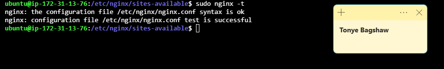

---

#### Screenshot 3 — Output of `curl -I http://<public-ip>` confirming recovery (200 OK)

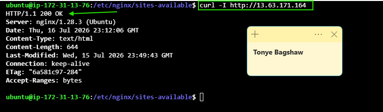

---

### Notes

Answer the following in your own words:

**1. What caused the configuration failure?**

The configuration failed because I intentionally added an error to the Nginx configuration file. When I ran sudo nginx -t, Nginx detected the syntax error and refused to accept the configuration.

---

**2. How did you fix the issue?**

I opened the configuration file, corrected the mistake, and saved the changes. Then I ran sudo nginx -t again to confirm the syntax was correct before restarting Nginx. Finally, I verified the recovery by sending a request with curl -I, which returned HTTP 200 OK.

---

**3. How can you avoid this kind of issue in real production systems?**

Always test the Nginx configuration with sudo nginx -t before reloading or restarting the service. Keep backups of working configurations, review changes carefully, and use version control so you can quickly roll back if something goes wrong.

---

# Task 7 — Web Application Failure Simulation

## Goal

Simulate missing deployment content and recover the application safely.

### Evidence

#### Screenshot 1 — Output of `curl -I http://<public-ip>` showing failure (non-200 response)

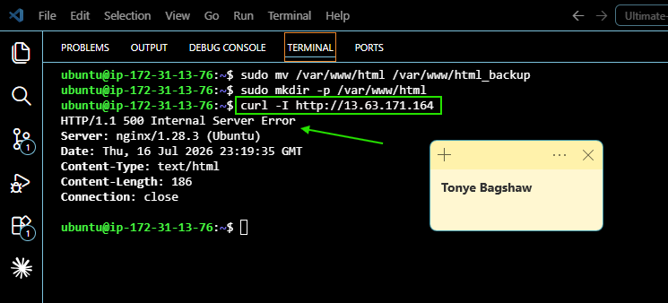

---

#### Screenshot 2 — Output of `curl -I http://<public-ip>` confirming recovery (200 OK)

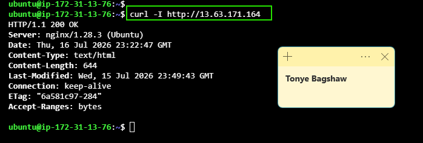

---

### Notes

Answer the following in your own words:

**1. What caused the application to break in this scenario?**

The application broke because the deployed files in the Nginx web root (/var/www/html) were removed by me. As a result, Nginx was running but could not find the application's files to serve, causing the website to return a non-200 response.

---

**2. How did you fix the issue and restore the application?**

I restored the React build files by copying them back into the /var/www/html directory. After confirming the files were present, I tested the application with curl -I and received a 200 OK response, confirming that the website had been restored successfully.

---

**3. What steps would you take to prevent this kind of issue in real production systems?**

I would keep backups of the deployed files, use version control and automated deployment pipelines, and always verify the deployment before replacing production files. I would also monitor the application after deployment so any issues can be detected and fixed quickly.

---

# Task 8 — Security & Reliability Review

## Goal

Review and reflect on the security and reliability practices applied during this assignment.

### Security & Reliability Notes

Answer the following in your own words:

**1. Why is SSH key-based authentication more secure than sharing passwords?**

SSH keys are more secure because they are much harder to guess or steal than passwords. They also reduce the risk of unauthorized access.

---

**2. Why should only required ports be open on a production server?**

Only the required ports should be open to reduce security risks. Closing unused ports makes it harder for attackers to access the server.

---

**3. Why is it important for Nginx to be enabled on boot?**

Enabling Nginx on boot ensures the website starts automatically whenever the server restarts, reducing downtime.

---

**4. What are the risks of sharing secrets, keys, or credentials publicly?**

If secrets or credentials are exposed, attackers can gain unauthorized access to your server or cloud resources, which may lead to data loss, security breaches, or unexpected costs.

---

**5. Why should cloud resources be stopped or terminated when they are no longer needed?**
Stopping or terminating unused cloud resources helps reduce costs and prevents unnecessary resources from becoming security risks.
Write your answer here.

---

# LinkedIn Post (Required)

## Evidence

#### LinkedIn Post URL

Paste your LinkedIn post URL here:

`https://www.linkedin.com/posts/tonye-bagshaw_devops-aws-ubuntu-ugcPost-7483665994205446144-imVH/?utm_source=share&utm_medium=member_desktop&rcm=ACoAADZfZhcBxSczrU0SYBi3qw_ndXsq3CkHOck`

---

#### Screenshot — Published LinkedIn post

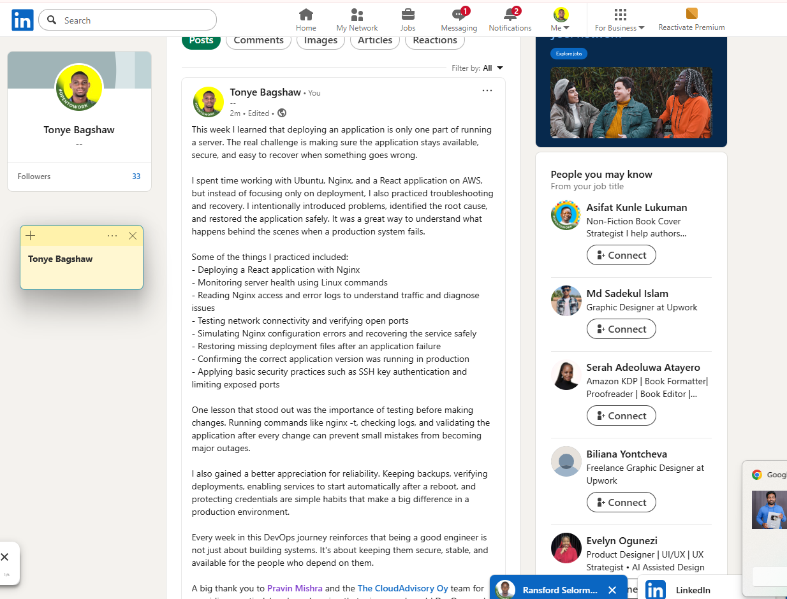

---

# Submission Instructions

- Add all required screenshots in your submission
- Full name must be visible in required screenshots
- Do not expose sensitive information (keys, passwords, account IDs)

---

# Completion Checklist

- [ ] Task 1: Screenshots (browser, ip a, ss -tulpen, ufw status) + Notes answered
- [ ] Task 2: Screenshots (nginx status, nginx -t, ss port 80) + Notes answered
- [ ] Task 3: Screenshots (access log, error log, journalctl) + Notes answered
- [ ] Task 4: Screenshots (uptime, free -h, df -h, du -sh) + Notes answered
- [ ] Task 5: Screenshots (ls html, grep deployed by, grep try_files) + Notes answered
- [ ] Task 6: Screenshots (nginx -t fail, nginx -t pass, curl recovery) + Notes answered
- [ ] Task 7: Screenshots (curl failure, curl recovery) + Notes answered
- [ ] Task 8: Security & Reliability Notes answered
- [ ] LinkedIn post published and URL submitted
- [ ] Full Name visible in all required screenshots
- [ ] No sensitive data exposed

---

## 📌 About DMI & CloudAdvisory

DevOps Micro Internship (DMI) is a project-based DevOps program run by Pravin Mishra (The CloudAdvisory) focused on real-world execution, systems thinking, and career readiness.

It helps learners build strong DevOps foundations with hands-on experience.

---

## 📌 Resources

- 🌐 DMI Official Website: https://pravinmishra.com/dmi  
- 🎓 DevOps for Beginners (Udemy): https://www.udemy.com/course/devops-for-beginners-docker-k8s-cloud-cicd-4-projects/  
- 🎓 Agentic AI DevOps with Claude Code: https://www.udemy.com/course/ultimate-agentic-ai-devops-with-claude-code/  
- 🎓 DevOps with Claude Code: Terraform, EKS, ArgoCD & Helm: https://www.udemy.com/course/devops-with-claude-code-terraform-eks-argocd-helm/  
- ▶️ YouTube Playlist: https://www.youtube.com/playlist?list=PLFeSNDtI4Cho  
- 🔗 Pravin Mishra (LinkedIn): https://www.linkedin.com/in/pravin-mishra-aws-trainer/  
- 🏢 CloudAdvisory (LinkedIn): https://www.linkedin.com/company/thecloudadvisory/

---

*This submission is part of DevOps Micro Internship (DMI) Cohort 3 — Agentic AI Track.*