# Assignment 5 — Bash Script Automation Drill (OPS Checklist)

Part of the DevOps Micro Internship (DMI) Cohort 3 with Agentic AI

---

## Purpose

In this assignment, you will practice Bash scripting by building a series of small automation scripts covering environment setup, variables, arrays, loops, file conditionals, if-else logic, and functions. These scripts form the foundation of real-world Linux automation used in DevOps, cloud, and production support environments.

---

# Task 1 — Bash Environment & Workspace Setup

## Goal

Verify that Bash is available on your system and create a clean workspace for this assignment.

### Evidence

#### Screenshot 1 — Output of `echo $SHELL` and `bash --version`

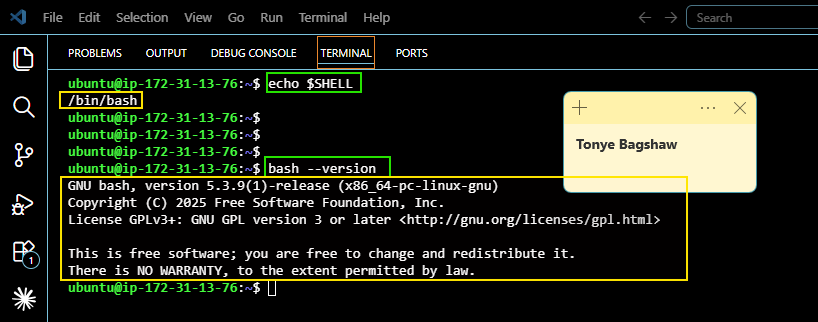

---

#### Screenshot 2 — Output of `pwd` and `ls -lah` showing the scripts directory

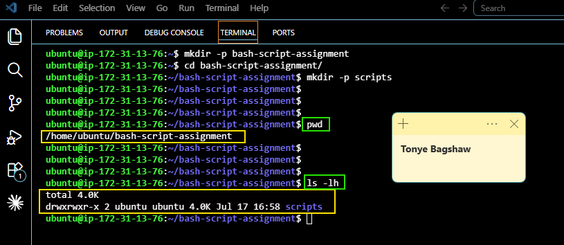

---

### Notes

Answer the following in your own words:

**1. What is Bash?**

Bash (Bourne Again Shell) is a command-line program that lets you interact with the Linux operating system. It allows you to run commands and automate tasks using scripts.

---

**2. What is the difference between shell and Bash?**

A shell is a program that lets you communicate with the operating system, while Bash is one type of shell, and it is one of the most commonly used shells on Linux systems.

---

**3. Why is it important to confirm the Bash version before writing scripts?**

Different Bash versions support different features. Checking the version helps ensure your script will work correctly on the system without compatibility issues.

---

# Task 2 — Your First Bash Script

## Goal

Create your first Bash script, make it executable, and run it from the terminal.

### Evidence

#### Screenshot 1 — Content of `first-script.sh`

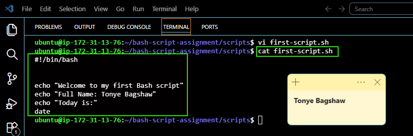

---

#### Screenshot 2 — Output of `./first-script.sh`

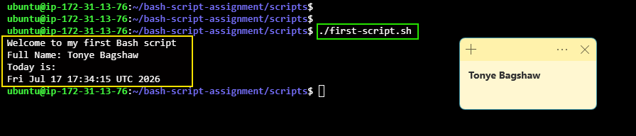

---

#### Screenshot 3 — Output of `ls -l first-script.sh` showing executable permission

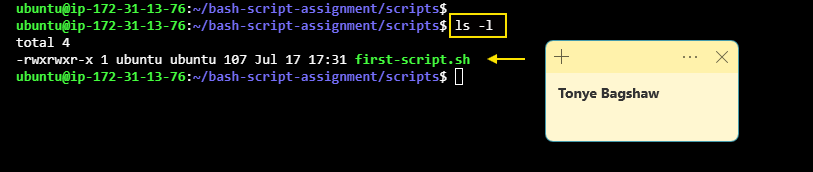

---

### Notes

Answer the following in your own words:

**1. What is the purpose of `#!/bin/bash`?**

#!/bin/bash tells the operating system to run the script using the Bash shell. It ensures the script is executed with the correct interpreter.

---

**2. Why do we use `chmod +x` before running a script?**

chmod +x gives the script permission to be executed. Without it, the operating system may not allow you to run the script directly.

---

**3. What is the difference between running a script using `./script.sh` and `bash script.sh`?**

./script.sh runs the script as an executable and requires execute permission (chmod +x). bash script.sh runs the script using the Bash interpreter directly, so it can work even if the script does not have execute permission.

---

# Task 3 — Variables: User Information Script

## Goal

Use variables to store and display user-related information.

### Evidence

#### Screenshot 1 — Content of `user-info.sh`

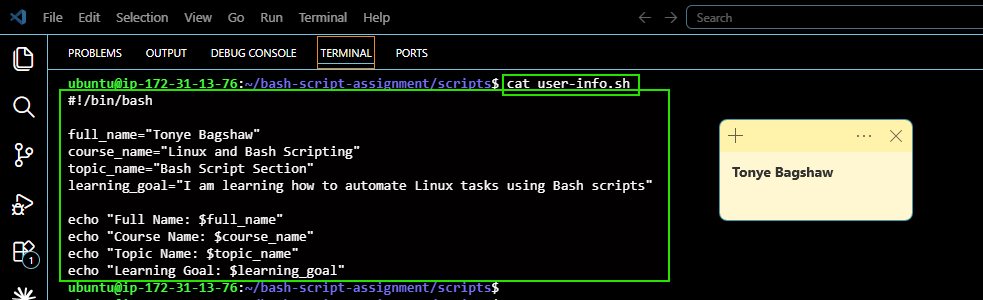

---

#### Screenshot 2 — Output of `./user-info.sh`

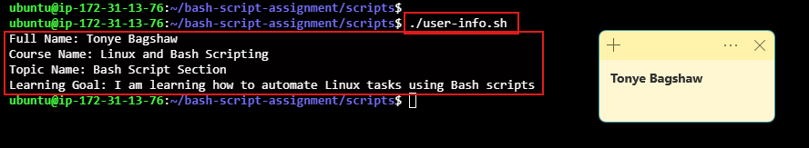

---

### Notes

Answer the following in your own words:

**1. What is a variable in Bash?**

A variable in Bash is a name used to store a value, such as text, numbers, or file paths, so it can be reused later in a script.

---

**2. Why should we avoid spaces around the `=` sign when creating variables?**
Bash does not allow spaces around the = sign when assigning a value to a variable. If you add spaces, Bash treats it as a command instead of a variable assignment, which causes an error.

---

**3. How do you access the value stored inside a Bash variable?**

You access the value of a Bash variable by placing a $ before the variable name. For example, if the variable is NAME, you use $NAME to get its value.

---

# Task 4 — Arrays & Loops: Tools Checklist Script

## Goal

Use arrays and loops to print a checklist of tools used in Bash scripting.

### Evidence

#### Screenshot 1 — Content of `tools-checklist.sh`

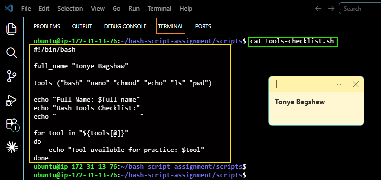

---

#### Screenshot 2 — Output of `./tools-checklist.sh`

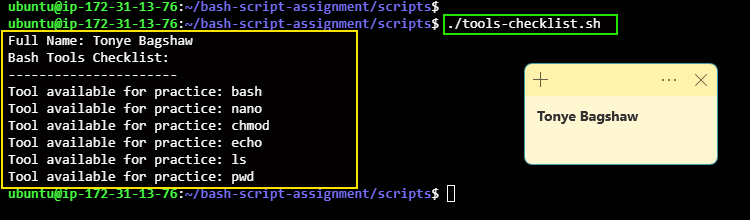

---

### Notes

Answer the following in your own words:

**1. What is an array in Bash?**

An array in Bash is a variable that can store multiple values under a single name. Each value is stored at a different position in the array.

---

**2. Why are arrays useful in scripts?**

Arrays make it easy to store and work with multiple related values. They help reduce repetitive code and make scripts easier to read and maintain.

---

**3. What does `"${tools[@]}"` mean?**

"${tools[@]}" refers to all the values stored in the tools array. It allows a script to use or loop through every item in the array.

---

**4. What is the purpose of the `for` loop in this script?**

The for loop goes through each item in the array one by one and performs the same action on each item. This avoids writing the same code multiple times.

---

# Task 5 — Loops: Number Counter Script

## Goal

Use loops to repeat a task multiple times.

### Evidence

#### Screenshot 1 — Content of `counter.sh`

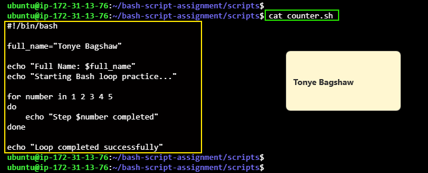

---

#### Screenshot 2 — Output of `./counter.sh`

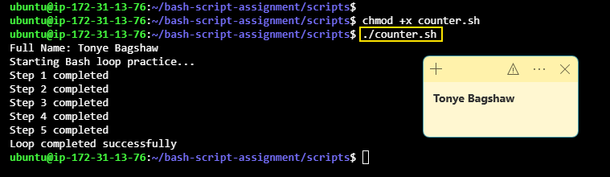

---

### Notes

Answer the following in your own words:

**1. What is a loop?**

A loop is a programming structure that repeats a set of commands until all the required tasks are completed or a condition is met.

---

**2. Why do we use loops in Bash scripting?**

Loops help automate repetitive tasks, making scripts shorter, easier to read, and more efficient.

---

**3. How many times did the loop run in your script?**

The loop ran once for each item it processed. For example, we had 5 items in the array, so the loop ran 5 times.

---

**4. What would you change if you wanted the loop to run 10 times?**

I would change the loop to iterate 10 times by using a range, for example: "for i in {1..10}"

---

# Task 6 — Files & Conditionals: File Validation Script

## Goal

Use file checks and conditionals to verify whether files and directories exist.

### Evidence

#### Screenshot 1 — Output of `ls -lah ../test-folder`

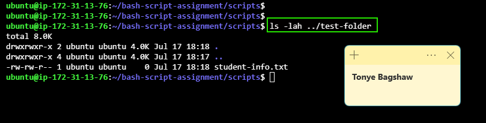

---

#### Screenshot 2 — Content of `file-check.sh`

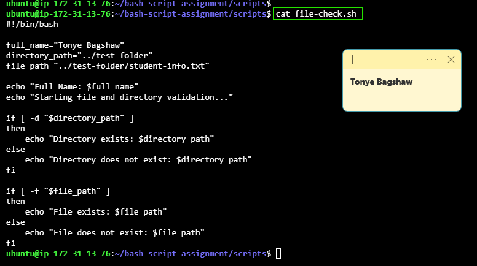

---

#### Screenshot 3 — Output of `./file-check.sh`

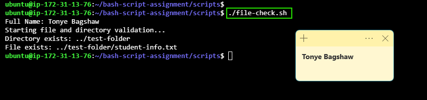

---

### Notes

Answer the following in your own words:

**1. What does `-d` check in Bash?**

-d checks whether a specified path exists and is a directory.

---

**2. What does `-f` check in Bash?**

-f checks whether a specified path exists and is a regular file.

---

**3. Why should file and directory paths be stored in variables?**

Storing paths in variables makes scripts easier to read, update, and reuse. If a path changes, you only need to update it in one place.

---

**4. What happens if the file does not exist?**

If the file does not exist, the -f check returns false, and the script can handle the situation, such as displaying an error message or taking another action.

---

# Task 7 — Conditionals: Pass or Retry Script

## Goal

Use if-else conditionals to make decisions based on a variable value.

### Evidence

#### Screenshot 1 — Content of `score-check.sh` with `score=85`

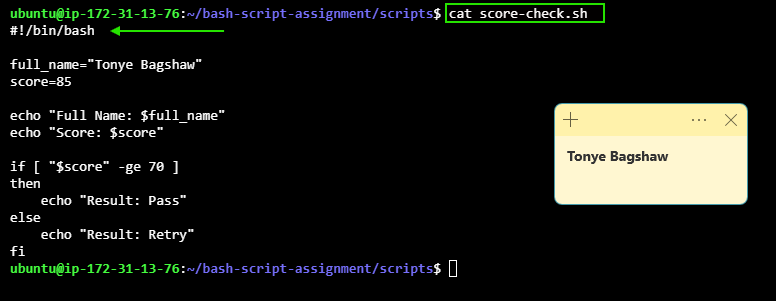

---

#### Screenshot 2 — Output showing `Result: Pass`

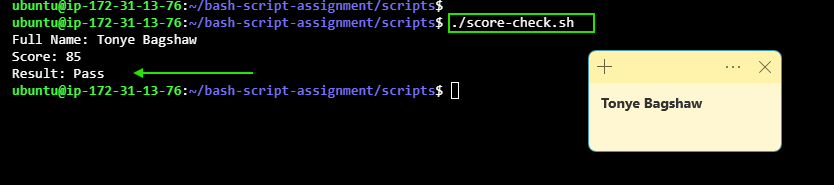

---

#### Screenshot 3 — Content of `score-check.sh` with `score=55`

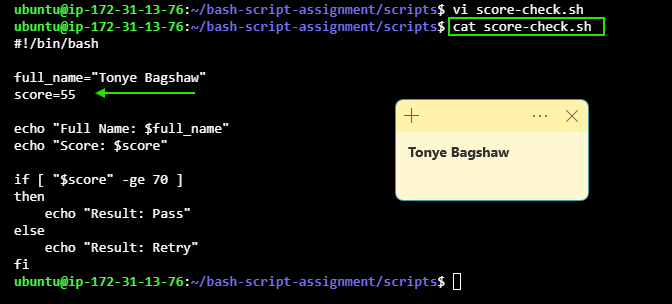

---

#### Screenshot 4 — Output showing `Result: Retry`

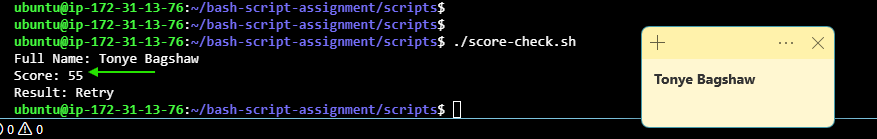

---

### Notes

Answer the following in your own words:

**1. What is the purpose of if-else in Bash?**

if-else lets a script make decisions. It runs one set of commands if a condition is true and another set if the condition is false.

---

**2. What does `-ge` mean?**

-ge means greater than or equal to. It is used to compare two numbers

---

**3. Why should conditions be tested with different values?**

Testing with different values helps make sure the script works correctly in different situations and handles both true and false conditions as expected.

---

**4. How can conditionals help in automation scripts?**

Conditionals allow automation scripts to make decisions based on different situations, making them more flexible and able to handle errors or different inputs automatically.

---

# Task 8 — Functions: Final Bash Automation Script

## Goal

Create a final Bash script using functions to organize reusable code.

### Evidence

#### Screenshot 1 — Content of `final-automation.sh`

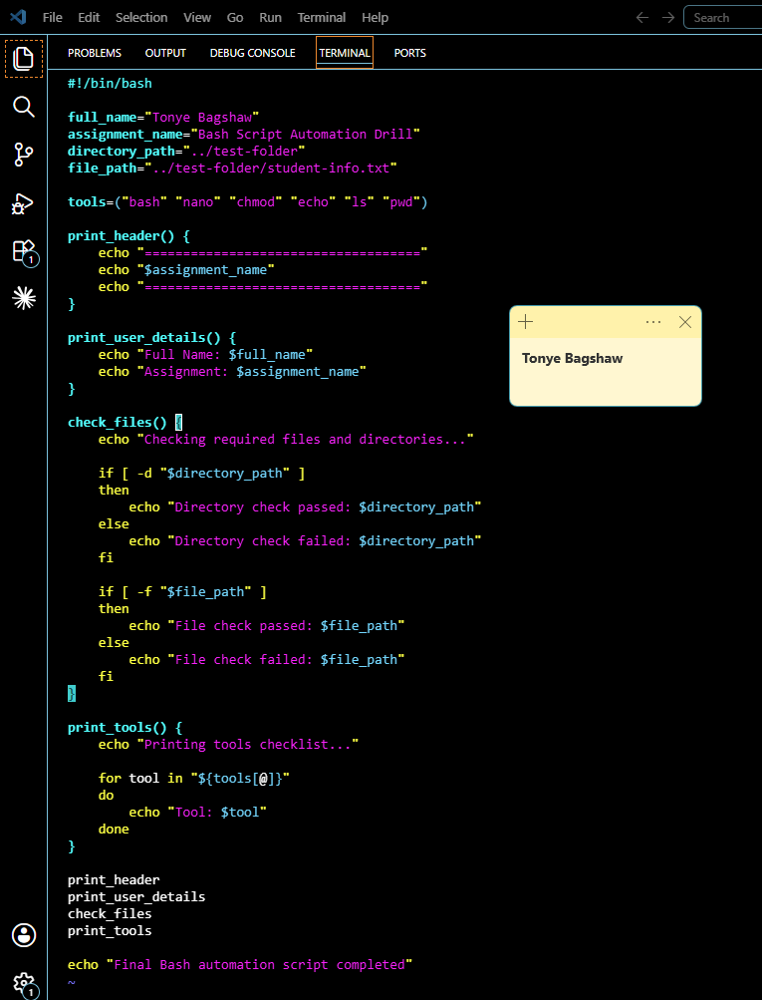

---

#### Screenshot 2 — Output of `./final-automation.sh`

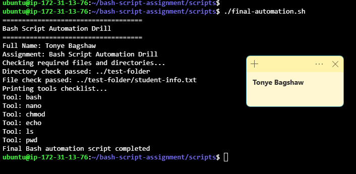

---

#### Screenshot 3 — Output of `ls -lah` showing all created scripts

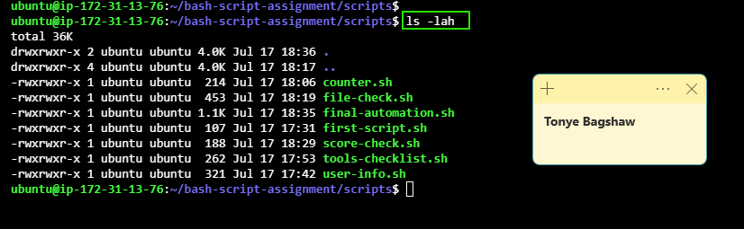

---

### Notes

Answer the following in your own words:

**1. What is a function in Bash?**

A function in Bash is a reusable block of code that performs a specific task. You can call it whenever you need it instead of writing the same code multiple times.

---

**2. Why are functions useful in scripts?**

Functions make scripts easier to read, organize, and maintain. They also reduce repeated code and make updates simpler.

---

**3. Which functions did you create in this script?**

print_header,
print_user_details,
check_files,
print_tools.

---

**4. How does this final script combine variables, arrays, loops, conditionals, files, and functions?**

The script uses variables to store values, arrays to hold multiple items, loops to process each item, conditionals to make decisions, file checks to verify files and directories, and functions to organize related tasks into reusable sections. Together, these features make the script more efficient, structured, and easier to maintain.

---

# LinkedIn Post (Required)

## Evidence

#### LinkedIn Post URL

Paste your LinkedIn post URL here:

`https://www.linkedin.com/posts/tonye-bagshaw_devops-linux-bash-share-7483958448573857792-JMlZ/?utm_source=share&utm_medium=member_desktop&rcm=ACoAADZfZhcBxSczrU0SYBi3qw_ndXsq3CkHOck`

---

#### Screenshot — Published LinkedIn post

---

# Submission Instructions

- Add all required screenshots in your submission
- Full name must be visible in required screenshots
- All script files must be created and run successfully
- Required notes must be answered clearly for every task
- Do not expose sensitive information (keys, passwords, credentials)

---

# Completion Checklist

- [ ] Task 1: Environment setup verified, workspace created (Screenshots 1–2, Notes answered)
- [ ] Task 2: First script created, executed, permissions verified (Screenshots 1–3, Notes answered)
- [ ] Task 3: Variables script created and run (Screenshots 1–2, Notes answered)
- [ ] Task 4: Arrays and loops script created and run (Screenshots 1–2, Notes answered)
- [ ] Task 5: Counter loop script created and run (Screenshots 1–2, Notes answered)
- [ ] Task 6: File validation script created and run (Screenshots 1–3, Notes answered)
- [ ] Task 7: Pass/Retry conditional script tested with both values (Screenshots 1–4, Notes answered)
- [ ] Task 8: Final automation script created and run (Screenshots 1–3, Notes answered)
- [ ] All scripts run without errors
- [ ] Full Name visible in all required screenshots
- [ ] LinkedIn post published and URL submitted
- [ ] No sensitive data exposed

---

## 📌 About DMI & CloudAdvisory

DevOps Micro Internship (DMI) is a project-based DevOps program run by Pravin Mishra (The CloudAdvisory) focused on real-world execution, systems thinking, and career readiness.

It helps learners build strong DevOps foundations with hands-on experience.

---

## 📌 Resources

- 🌐 DMI Official Website: https://pravinmishra.com/dmi  
- 🎓 DevOps for Beginners (Udemy): https://www.udemy.com/course/devops-for-beginners-docker-k8s-cloud-cicd-4-projects/  
- 🎓 Agentic AI DevOps with Claude Code: https://www.udemy.com/course/ultimate-agentic-ai-devops-with-claude-code/  
- 🎓 DevOps with Claude Code: Terraform, EKS, ArgoCD & Helm: https://www.udemy.com/course/devops-with-claude-code-terraform-eks-argocd-helm/  
- ▶️ YouTube Playlist: https://www.youtube.com/playlist?list=PLFeSNDtI4Cho  
- 🔗 Pravin Mishra (LinkedIn): https://www.linkedin.com/in/pravin-mishra-aws-trainer/  
- 🏢 CloudAdvisory (LinkedIn): https://www.linkedin.com/company/thecloudadvisory/

---

*This submission is part of DevOps Micro Internship (DMI) Cohort 3 — Agentic AI Track.*