# Assignment 6 — Build an AI-Assisted Linux Health Check (AI-Assisted Linux Incident Triage)

Part of the DevOps Micro Internship (DMI) Cohort 3 with Agentic AI

---

## Purpose

In this assignment, you will build a read-only Bash triage script that checks the health of your Ubuntu server and Nginx application, connect it to Claude Code as a reusable `/linux-triage` skill, simulate a controlled Nginx incident, use the skill to gather and analyze evidence, recover the service manually, and verify recovery. The workflow follows the Agentic Loop: Gather → Analyze → Human Act → Verify.

---

# Task 1 — Confirm the Healthy Baseline and Create the Workspace

## Goal

Confirm that Nginx and the React application are healthy before building the automation.

### Evidence

#### Screenshot 1 — Output of `systemctl is-active nginx`, `ss -ltn | grep ':80'`, and `curl -I http://localhost`

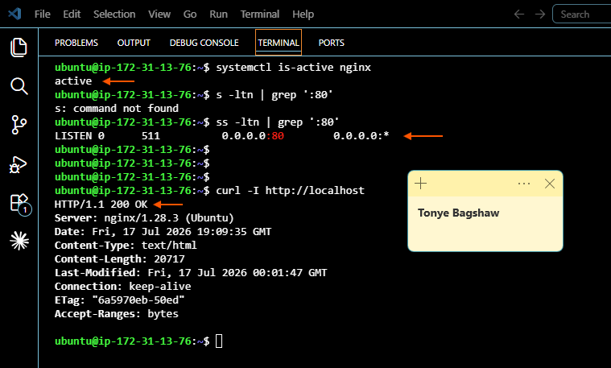

---

#### Screenshot 2 — Output of `pwd` and `find . -maxdepth 4 -type d | sort` showing the workspace folder structure

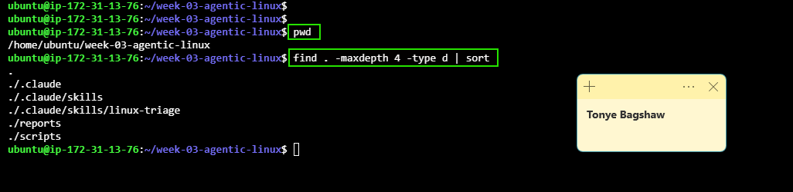

---

### Notes

Answer the following in your own words:

**1. What proves that Nginx is running?**

The systemctl is-active nginx command returns active, which confirms that the Nginx service is running properly.

---

**2. What proves that the server is listening for HTTP traffic?**

The ss -ltn | grep ':80' command shows that port 80 is listening, and curl -I http://localhost returns a 200 OK response. This confirms the server is accepting and serving HTTP requests.

---

**3. Why must you capture a healthy baseline before simulating an incident?**

A healthy baseline shows that everything is working correctly before making changes. This makes it easier to identify what caused the problem and verify that the system has been fully restored after the incident.

---

# Task 2 — Create Project Context and Safety Rules in CLAUDE.md

## Goal

Tell Claude exactly what this project does and what it is not allowed to do.

### Evidence

#### Screenshot 3 — CLAUDE.md open in VS Code showing all four sections (Project Overview, Incident Workflow, Safety Rules, Output Rules)

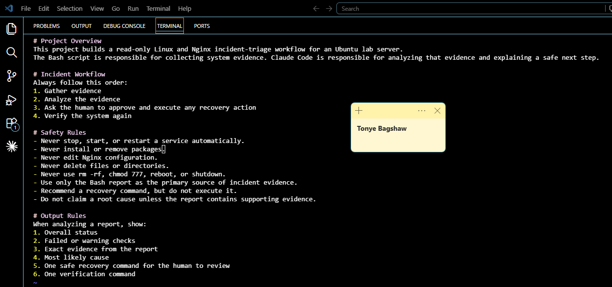

---

### Notes

Answer the following in your own words:

**1. Why should Claude receive project-specific operational rules?**

Project-specific rules help Claude give safe and consistent recommendations that match the project's requirements and avoid risky actions.

---

**2. Why is the human required to execute the recovery command?**

The human must execute the recovery command to review and approve it first. This prevents accidental changes and keeps the final decision under human control.

---

**3. Which rule prevents Claude from making an unsupported diagnosis?**

Safety rule prevents Claude from making an unsupported diagnosis. This ensures Claude only makes conclusions based on the available evidence.

---

# Task 3 — Use Agentic AI to Plan Before Writing the Script

## Goal

Use Claude Code to inspect the environment and produce a read-only plan before creating any Bash code.

### Evidence

#### Screenshot 4 — Claude Code showing the five-check plan and read-only inspection results

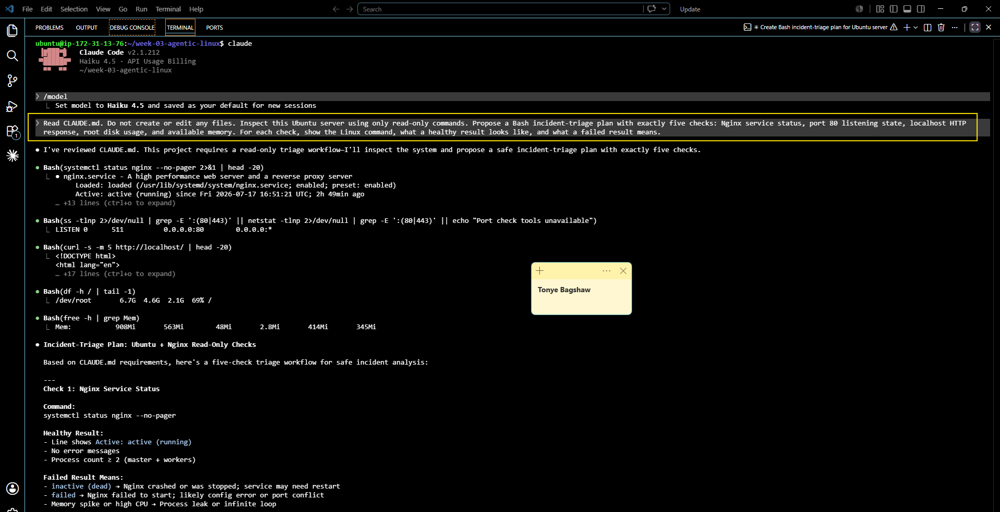

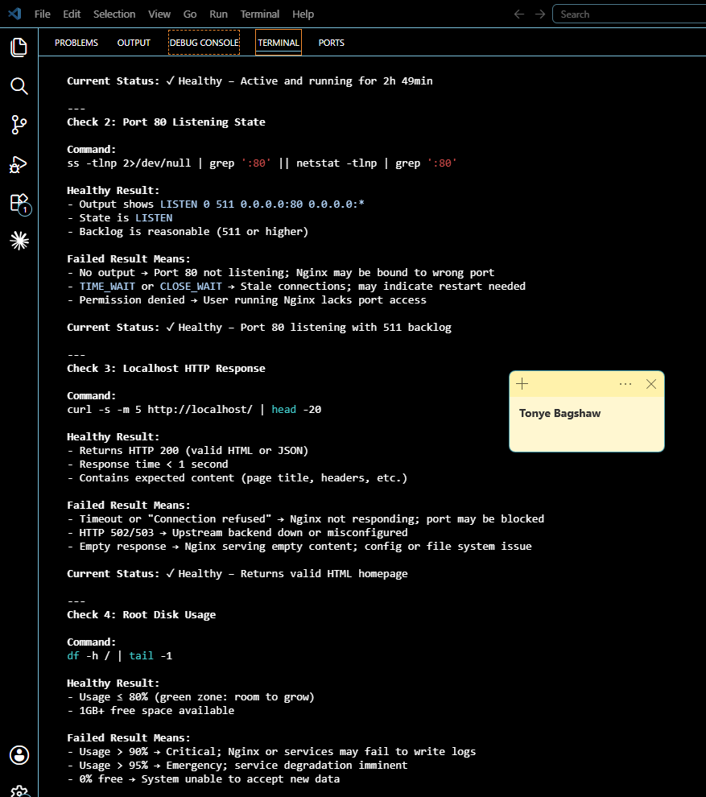

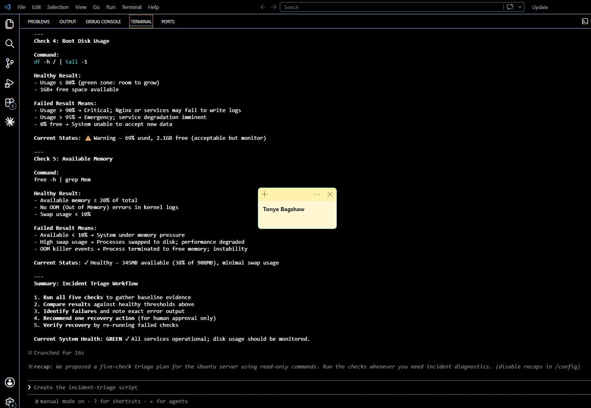
---

### Notes

Answer the following in your own words:

**1. Which part of this task represents the Gather phase?**
The Gather phase is when Claude used read-only commands like systemctl, ss, curl, df, and free to collect information about the server without making any changes.
Add your answer here.

---

**2. Did Claude follow the instruction not to create files? How did you verify this?**

Yes. Claude only ran read-only commands to inspect the server and displayed a triage plan. It did not create, edit, or delete any files. I verified this by running the ls command.

---

**3. Why is planning before coding useful in DevOps automation?**

Planning helps identify the correct steps before making changes. This reduces mistakes, improves safety, and makes the automation more reliable.

---

# Task 4 — Build the Linux Triage Bash Script

## Goal

Create one Bash script that gathers consistent Linux and Nginx health evidence.

### Evidence

#### Screenshot 5 — Top section of `linux-triage.sh` showing variables, thresholds, and the checks array

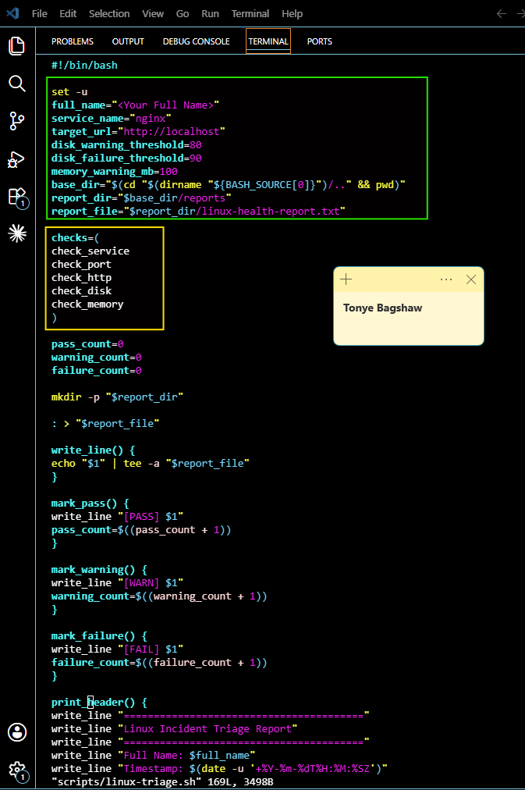

---

#### Screenshot 6 — Middle section showing check functions and conditionals

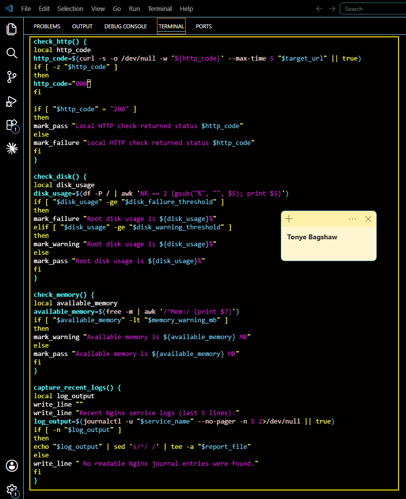

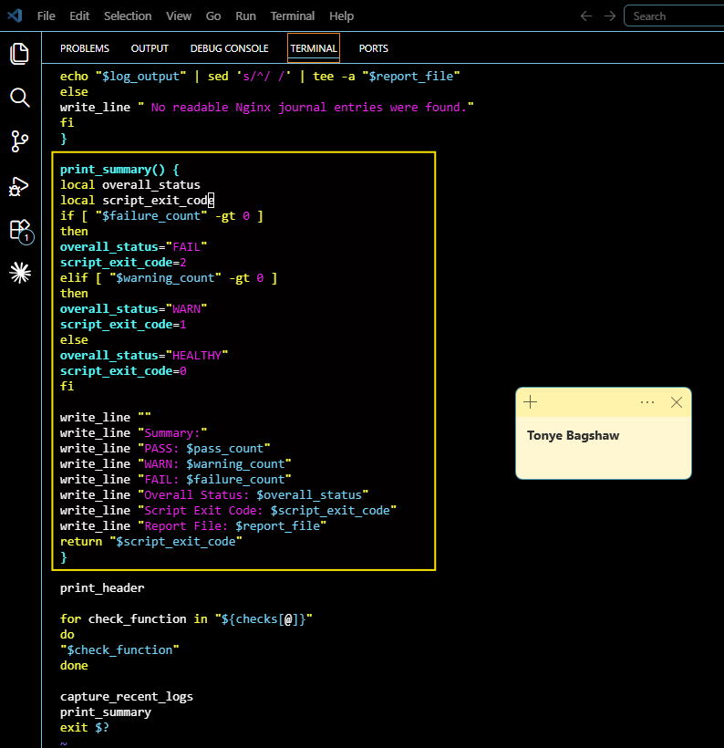

---

#### Screenshot 7 — Bottom section showing the loop, summary function, and exit behavior

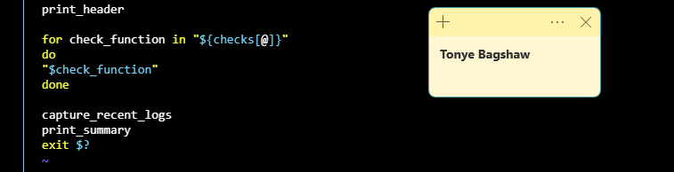

---

#### Screenshot 8 — Output of `bash -n scripts/linux-triage.sh` (no syntax errors) and `ls -l scripts/linux-triage.sh` showing executable permission

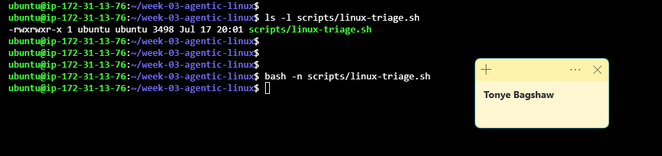

---

### Notes

Answer the following in your own words:

**1. What is stored in the checks array?**

The checks array stores the names of the health check functions that the script needs to run, such as check_service, check_port, check_http, check_disk, and check_memory.

---

**2. How does the `for` loop use that array?**

The for loop goes through each function name in the checks array and executes it one by one. This allows all health checks to run automatically without writing each function call separately.

---

**3. Why are the health checks separated into functions?**

Separating the checks into functions makes the script easier to read, maintain, and troubleshoot. Each function has a single responsibility and can be updated independently without affecting the rest of the script.

---

**4. What is the purpose of `$(...)` in this script?**

$(...) is used for command substitution. It runs a command and stores its output in a variable or inserts the output into another command.

---

**5. Why does the script use different exit codes for HEALTHY, WARN, and FAIL?**

Different exit codes allow other scripts, monitoring tools, or automation systems to understand the result of the health check. 0 means everything is healthy, 1 indicates a warning, and 2 indicates a failure that may require attention.

---

# Task 5 — Run and Understand the Healthy-State Report

## Goal

Run the Bash script against the healthy server and verify that it creates a report.

### Evidence

#### Screenshot 9 — Output of `./scripts/linux-triage.sh` showing your Full Name and all five check results

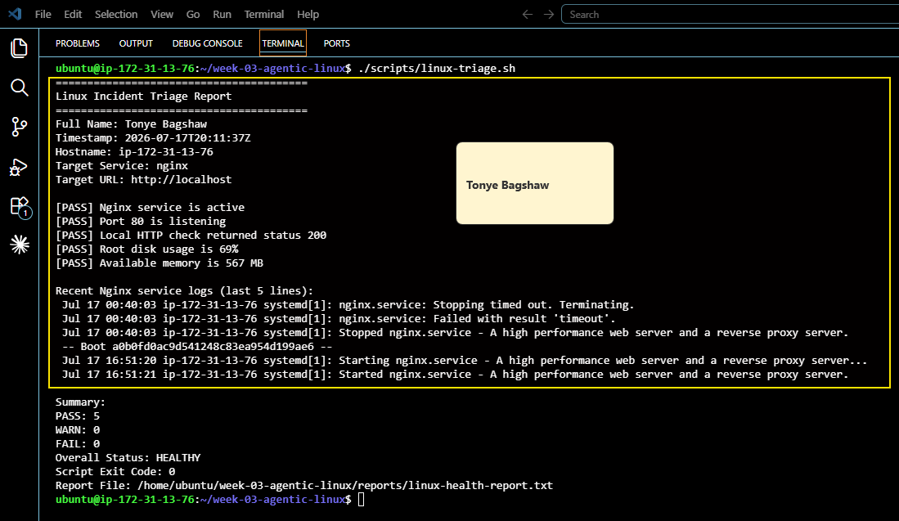

---

#### Screenshot 10 — Output showing the captured exit code and final summary

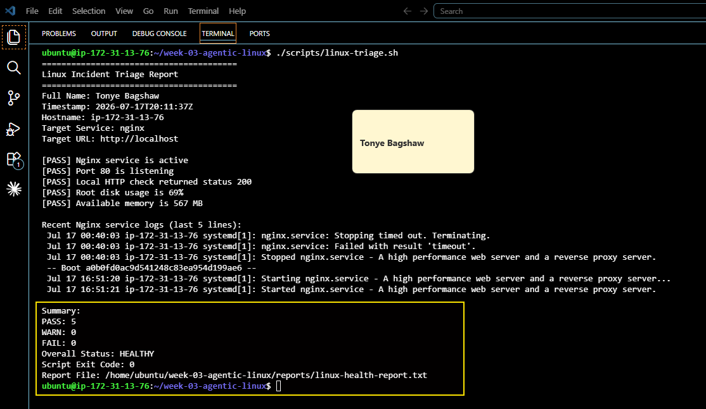

---

### Notes

Answer the following in your own words:

**1. What is the overall status of your healthy baseline?**

The overall status is HEALTHY. All five health checks passed, with no warnings or failures.

---

**2. Which exact Linux evidence proves the application is serving traffic?**

The evidence is [PASS] Local HTTP check returned status 200, which confirms that Nginx is successfully serving the application on http://localhost.

---

**3. Did your script return exit code 0 or 1? Explain why.**

The script returned exit code 0 because all health checks passed and the overall status was HEALTHY, with no warnings or failures.

---

**4. What is the difference between a warning and a failure in this script?**

A warning means the system is still working but needs attention, such as high disk usage or low memory. A failure means a critical check did not pass, such as Nginx not running or the HTTP check failing, and the issue should be investigated immediately.

---

# Task 6 — Create and Run the /linux-triage Skill

## Goal

Turn the Bash script into a reusable, manually invoked Agentic AI workflow.

### Evidence

#### Screenshot 11 — `SKILL.md` showing the frontmatter, allowed tool restrictions, and safety rules

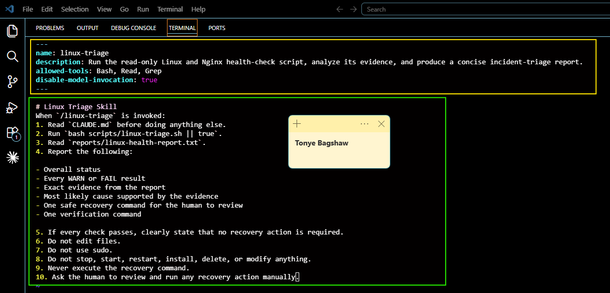

---

#### Screenshot 12 — `/linux-triage` output for the healthy server

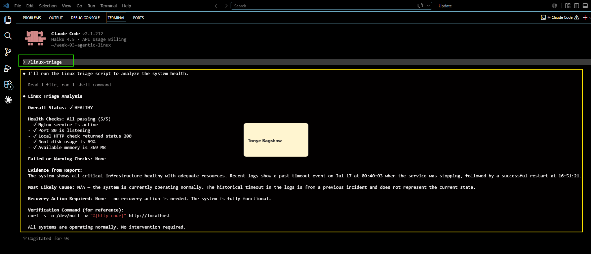

---

### Notes

Answer the following in your own words:

**1. Why does this skill have Bash, Read, and Grep, but not Write?**

The skill only needs to run commands, read the report, and search for information. It does not need to change any files, so the Write tool is removed to keep the system safe.

---

**2. Why is `disable-model-invocation: true` useful for this skill?**

It makes sure the skill follows the predefined steps instead of letting the AI make its own decisions. This keeps the workflow consistent and predictable.

---

**3. What part is performed by Bash, and what part is performed by Claude?**

Bash does the gathering of evidence. Claude reads the report, analyzes the results, explains what they mean, and suggests a safe recovery command without running it.

---

**4. Why is this better than asking Claude "Is my server healthy?" without giving it evidence?**

It is better because it lets Claude uses real system data instead of guessing. The report provides evidence, making the analysis more accurate, reliable, and based on the actual state of the server.

---

# Task 7 — Simulate an Nginx Incident and Let the Skill Diagnose It

## Goal

Create a controlled service failure, gather evidence through Bash, and let Claude analyze the evidence without taking recovery action.

### Evidence

#### Screenshot 13 — Output showing Nginx is inactive and the HTTP request fails

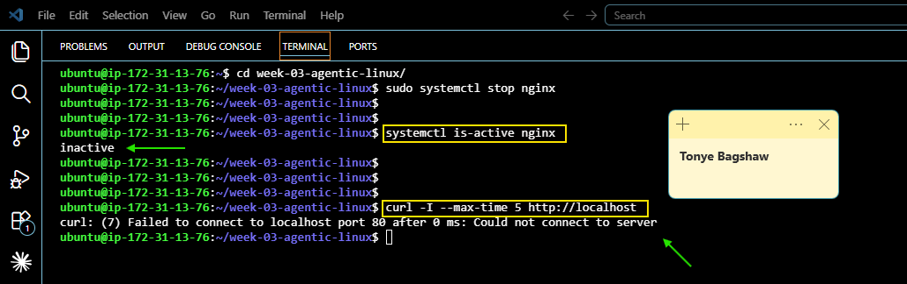

---

#### Screenshot 14 — `/linux-triage` output showing failed evidence, most likely cause, and a suggested recovery command

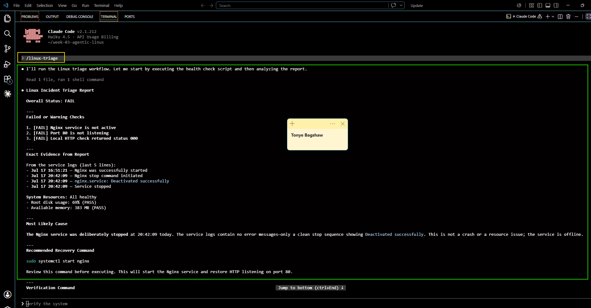

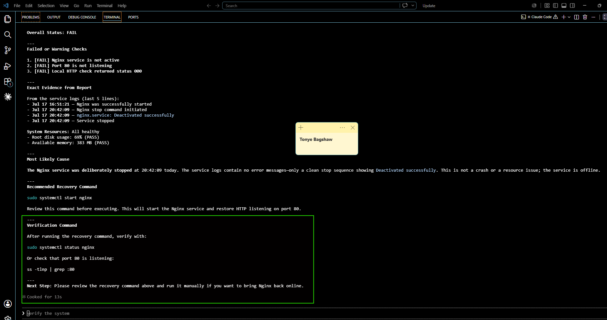

---

#### Screenshot 15 — `incident-failure-report.txt` showing the failed checks and your Full Name

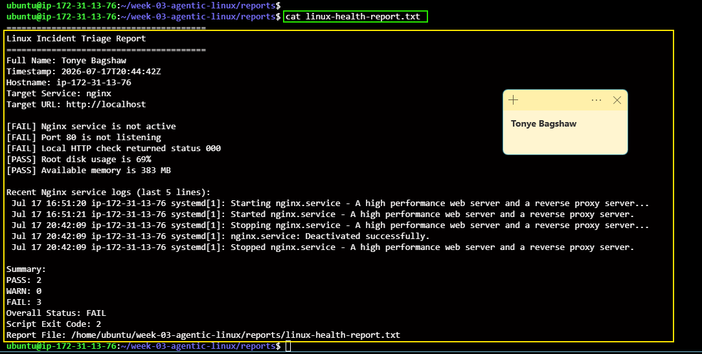

---

### Notes

Answer the following in your own words:

**1. Which three checks failed?**

Nginx service is not active.

Port 80 is not listening.

Local HTTP check returned status 000.

---

**2. What evidence supports the conclusion that Nginx is unavailable?**

[FAIL] Nginx service is not active

---

**3. Did Claude execute the recovery command? Why is that important?**

No. Claude only recommended a recovery command and left it for me to review. 

---

**4. Which phase of the Agentic Loop is represented by the Bash report?**

The Bash report represents the Gather phase because it collects evidence about the system's health.

---

**5. Which phase is represented by Claude's explanation?**

Claude's explanation represents the Analyze phase because it interprets the evidence, identifies the likely issue, and recommends a safe next step.

---

# Task 8 — Recover Manually, Verify Again, and Write the Incident Summary

## Goal

Recover the service as the human operator and prove that the system is healthy again.

### Evidence

#### Screenshot 16 — Output showing Nginx is active and `curl -I http://localhost` returns 200 OK

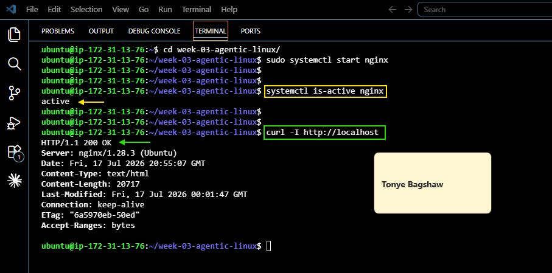

---

#### Screenshot 17 — Second `/linux-triage` output showing successful recovery with no FAIL results

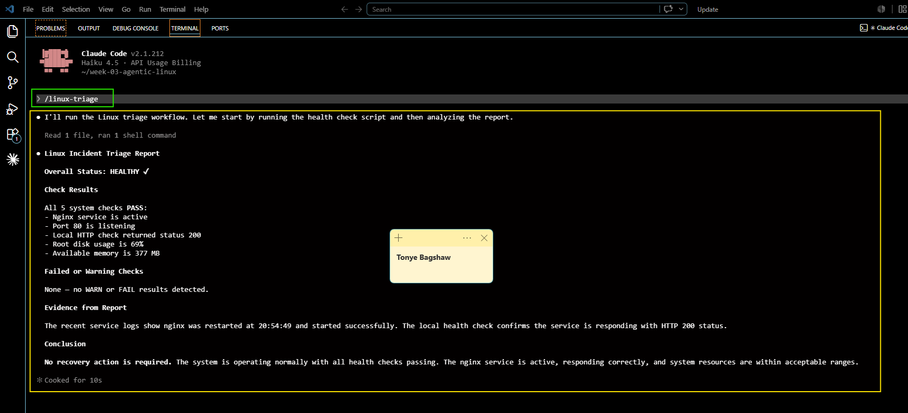

---

#### Screenshot 18 — Output of `ls -lah reports` showing both `incident-failure-report.txt` and `recovery-report.txt`

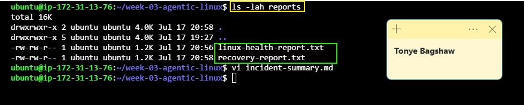

---

#### Screenshot 19 — `incident-summary.md` showing all required sections and your Full Name

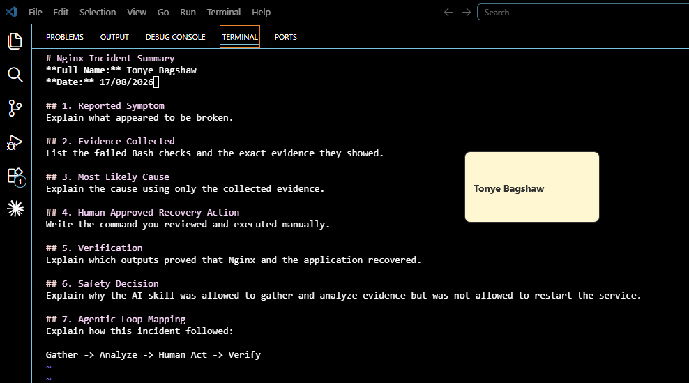

---

### Notes

Answer the following in your own words:

**1. What action did you execute manually?**

I manually started the Nginx service using systemctl start nginx

---

**2. What evidence proves that the service recovered?**

The second triage report showed that Nginx was active, port 80 was listening, the local HTTP check returned 200, and the overall status changed to HEALTHY.

---

**3. Why is the second triage run necessary?**

It confirms that the recovery worked and verifies that the system is healthy after the manual action.

---

**4. What could go wrong if an AI agent automatically restarted every failed service?**

It could restart the wrong service, hide the real problem, interrupt users, or make the issue worse without human approval.

---

**5. In one sentence, explain the difference between using AI as a chatbot and using AI in this agentic workflow.**

A chatbot mainly answers questions, while an agentic AI follows a structured workflow to gather evidence, analyze it, recommend actions, and let the human decide what to do next.

---

# Incident Summary

Fill in all seven sections below in your own words.

**Full Name:** Tonye Bagshaw

**Date:** 17/08/2026

---

**1. Reported Symptom**

The website was unavailable because the Nginx service stopped running, so users could not access the application.

---

**2. Evidence Collected**

Nginx service was not active.

Port 80 was not listening.

Local HTTP check returned status 000.

The Nginx logs showed the service had been stopped.

---

**3. Most Likely Cause**

The Nginx service was stopped, preventing it from listening on port 80 and serving the website.

---

**4. Human-Approved Recovery Action**

The recommended recovery command was reviewed and then manually executed by starting the Nginx service.

---

**5. Verification**

The health-check script was run again and confirmed that Nginx was active, port 80 was listening, the HTTP check returned 200, and the overall status was HEALTHY.

---

**6. Safety Decision**

Claude did not execute the recovery command automatically. It only recommended the command and waited for human approval before any changes were made.

---

**7. Agentic Loop Mapping**

Gather: Bash collected the system health report.

Analyze: Claude analyzed the report and identified the likely cause.

Act: The human manually executed the approved recovery command.

Verify: The health-check script was run again to confirm the server had recovered

---

# LinkedIn Post (Required)

## Evidence

#### LinkedIn Post URL

Paste your LinkedIn post URL here:

`https://www.linkedin.com/posts/tonye-bagshaw_devops-linux-ubuntu-ugcPost-7483994242852216833-ew1G/?utm_source=share&utm_medium=member_desktop&rcm=ACoAADZfZhcBxSczrU0SYBi3qw_ndXsq3CkHOck`

---

#### Screenshot — Published LinkedIn post

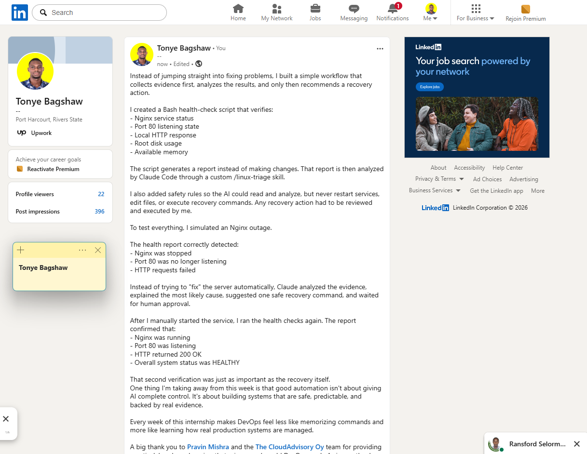

---

# GitHub Repository URL

Paste the URL of your GitHub folder or repository containing the assignment files here:

`https://github.com/Viqshaw/devops-micro-internship-pravinmishra.git`

---

# Submission Instructions

- Add all required screenshots in your submission
- Full Name must be visible in required screenshots and the Bash report
- All written answers must be in your own words
- Do not expose sensitive information (keys, passwords, AWS account IDs, tokens)
- GitHub URL must be included in this document

---

# Completion Checklist

- [ ] Task 1: Healthy baseline confirmed, workspace created (Screenshots 1–2, Notes answered)
- [ ] Task 2: CLAUDE.md created with all four sections (Screenshot 3, Notes answered)
- [ ] Task 3: Five-check plan produced by Claude using read-only tools (Screenshot 4, Notes answered)
- [ ] Task 4: `linux-triage.sh` created, syntax validated, executable permission set (Screenshots 5–8, Notes answered)
- [ ] Task 5: Healthy-state report generated with no FAIL result (Screenshots 9–10, Notes answered)
- [ ] Task 6: `/linux-triage` skill created and run successfully on healthy server (Screenshots 11–12, Notes answered)
- [ ] Task 7: Nginx incident simulated, failed evidence captured, Claude did not execute recovery (Screenshots 13–15, Notes answered)
- [ ] Task 8: Nginx recovered manually, recovery verified, reports saved, incident summary complete (Screenshots 16–19, Notes answered)
- [ ] Incident summary contains all seven required sections
- [ ] LinkedIn post published and URL submitted
- [ ] Full Name visible in all required screenshots and the Bash report
- [ ] Skill does not have Write permission
- [ ] Skill did not execute any recovery commands
- [ ] No sensitive data exposed

---

## 📌 About DMI & CloudAdvisory

DevOps Micro Internship (DMI) is a project-based DevOps program run by Pravin Mishra (The CloudAdvisory) focused on real-world execution, systems thinking, and career readiness.

It helps learners build strong DevOps foundations with hands-on experience.

---

## 📌 Resources

- 🌐 DMI Official Website: https://pravinmishra.com/dmi  
- 🎓 DevOps for Beginners (Udemy): https://www.udemy.com/course/devops-for-beginners-docker-k8s-cloud-cicd-4-projects/  
- 🎓 Agentic AI DevOps with Claude Code: https://www.udemy.com/course/ultimate-agentic-ai-devops-with-claude-code/  
- 🎓 DevOps with Claude Code: Terraform, EKS, ArgoCD & Helm: https://www.udemy.com/course/devops-with-claude-code-terraform-eks-argocd-helm/  
- ▶️ YouTube Playlist: https://www.youtube.com/playlist?list=PLFeSNDtI4Cho  
- 🔗 Pravin Mishra (LinkedIn): https://www.linkedin.com/in/pravin-mishra-aws-trainer/  
- 🏢 CloudAdvisory (LinkedIn): https://www.linkedin.com/company/thecloudadvisory/

---

*This submission is part of DevOps Micro Internship (DMI) Cohort 3 — Agentic AI Track.*