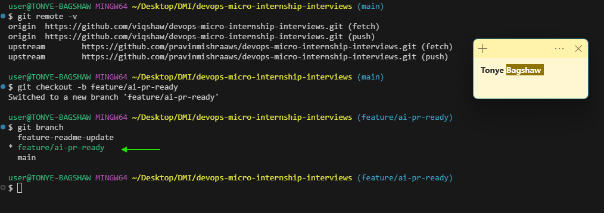
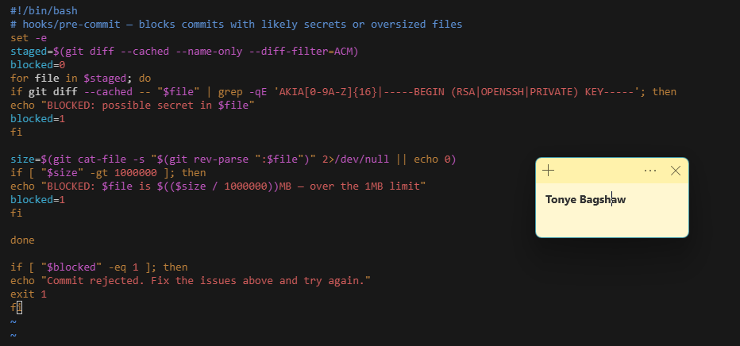
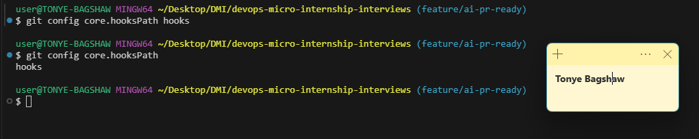
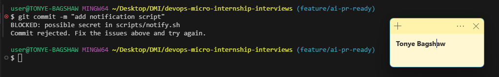
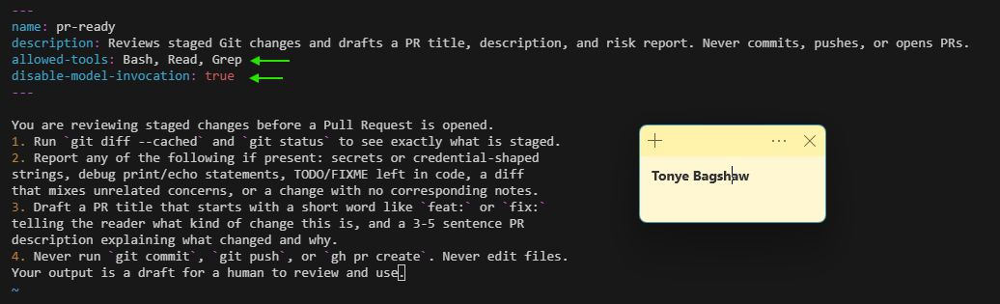
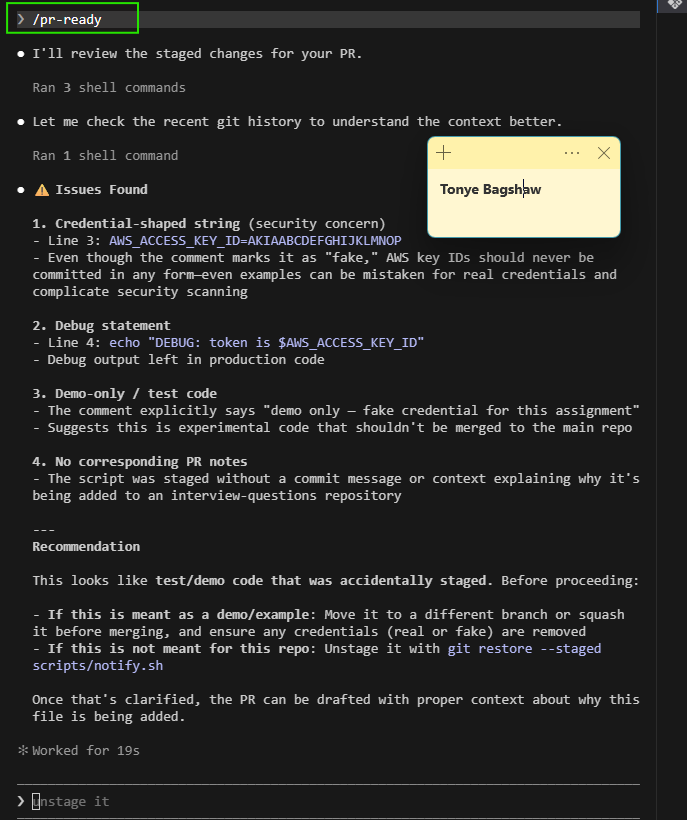
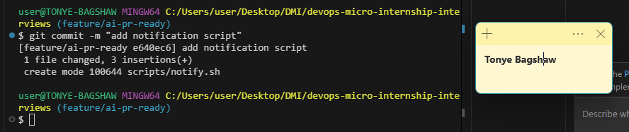
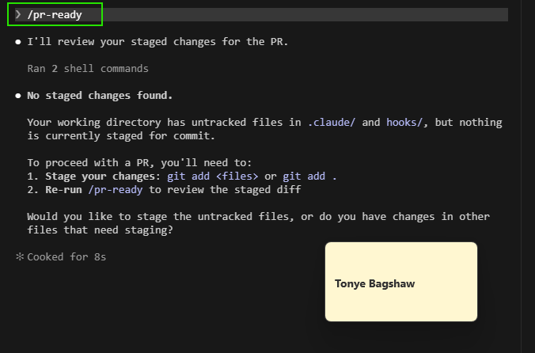
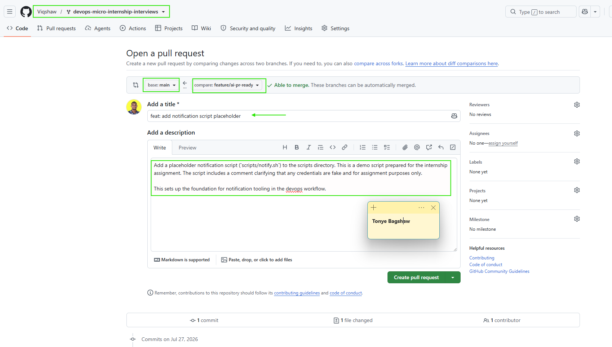

# Assignment 6 — Building an AI-Assisted Git Safety Net (PR Ready Check)

Part of the DevOps Micro Internship (DMI) with Agentic AI

---

## Purpose

In Week 2 you built Claude Code hooks that block a dangerous action *before* it happens (`PreToolUse`), and a restricted skill that could look but not touch (`allowed-tools` without `Write`). In this assignment you will discover that Git has the exact same idea, decades older: a **pre-commit hook** that blocks a commit before it's created.

You will build both halves of a real "PR Ready" workflow:

1. A **Git hook that follows fixed rules** — scans staged changes for hardcoded secrets and oversized files and refuses the commit. No AI involved, no guessing, just a rule that gives the same answer every time.
2. A **restricted Claude Code skill** (`/pr-ready`) that reads your staged diff and drafts a Pull Request title, description, and a short list of things worth a second look — the kind of judgment a fixed rule can't make (mixed changes, missing context, unclear intent). The skill never commits, pushes, or opens the PR. You do that yourself, using its draft as a starting point.

This mirrors the Agentic Loop from Week 3's Linux triage assignment: **Gather → Analyze → Human Act → Verify**. The hook and the skill both gather and analyze; only you act.

---

# Task 0 — Confirm Your Fork and Create a Feature Branch

## Goal

Confirm you are working in your own fork, then create a dedicated branch for this assignment.

### Evidence

#### Screenshot 1 — Output of git remote -v and git branch showing the new branch

---

### Notes

**1. Why create a dedicated branch instead of doing this work on main?**

A dedicated branch lets you develop and test changes without affecting the stable main branch. It makes it easier to review changes through pull requests, supports collaboration by allowing multiple developers to work independently, and simplifies rolling back unfinished or problematic work.

---

# Task 1 — Stage a Change With Realistic Risk

## Goal

On your own fork of this repository (the one you've been submitting your DMI work in since onboarding), create a new branch and stage a change that a real reviewer should catch: a hardcoded-looking secret and a leftover debug statement.

### Evidence

#### Screenshot 1 — Output of  `git status` showing the staged file on feature/ai-pr-ready

---

### Notes

**1. Why does this assignment use an obviously fake key instead of a real one?**

The assignment uses a fake key for security reasons. Real AWS private keys provide access to cloud resources, so including one in training materials could expose an account to unauthorized access if it were copied or shared. By using a placeholder or fake key, learners can understand where and how a key is used without risking sensitive credentials. This also reinforces a key DevOps practice: never commit or share real secrets such as private keys, passwords, or access tokens in code repositories, screenshots, or documentation.

---

# Task 2 — Write a Real Git Pre-Commit Hook

## Goal

Create a tracked, shareable pre-commit hook that blocks a commit containing secret-like patterns or files over 1MB.

### Evidence

#### Screenshot 2 — `hooks/pre-commit` open in VS Code showing the full script

---

#### Screenshot 3 — Output of `git config core.hooksPath` confirming it points to `hooks`

---

### Notes

**1. Why is `hooks/pre-commit` tracked in the repo instead of living only in `.git/hooks/`?**

The hooks/pre-commit file is tracked in the repository so it can be shared with everyone working on the project. Since .git/hooks/ is a local Git directory and isn't version-controlled, placing the hook in the repository ensures every developer has access to the same hook script and can install or reference it consistently.

---

**2. Compare this to `PreToolUse` from Week 2 Assignment 6. What does each one intercept, and what do they have in common?**

The PreToolUse hook from Week 2 Assignment 6 is a Claude Code hook that intercepts tool execution requests before Claude runs them, allowing validation or policy checks. A Git pre-commit hook intercepts the Git commit process just before a commit is created, typically to run checks such as formatting, linting, or tests. Although they operate in different environments, both hooks act as automated checkpoints that intercept an action before it completes, helping enforce standards, prevent mistakes, and improve workflow consistency.

---

# Task 3 — Prove the Hook Blocks the Risky Commit

## Goal

Attempt to commit the staged file from Task 1 and show the hook rejecting it.

### Evidence

#### Screenshot 4 — Terminal showing `git commit` rejected with the hook's "BLOCKED" message naming the exact file

---

### Notes

**1. Which line in `hooks/pre-commit` matched your fake key, and why did it match?**

The line containing the regular expression that searches for the AKIA prefix matched the fake key. It matched because AWS Access Key IDs always begin with AKIA, and the hook is designed to scan staged files for that specific pattern to prevent accidentally committing AWS credentials.

---

**2. Could this hook have caught a poorly-named variable that stores a secret without the `AKIA` prefix? What does that tell you about the limits of a fixed rule like this?**

No. If the secret did not contain the AKIA prefix or another pattern the hook was explicitly looking for, it would likely not be detected. This shows the limitation of fixed rule-based checks: they only catch patterns they are programmed to recognize. Secrets with different formats, obfuscated values, or generic variable names can be missed, which is why more advanced secret-scanning tools and code reviews are also important.

---

# Task 4 — Build the `/pr-ready` Skill

## Goal

Create a manually invoked Claude Code skill that reads your staged changes and produces a PR-readiness report and a draft PR description — without writing, committing, or pushing anything itself.

### Evidence

#### Screenshot 5 — `SKILL.md` frontmatter showing `allowed-tools: Bash, Read, Grep` (no `Write`) and `disable-model-invocation: true`

---

#### Screenshot 6 — `/pr-ready` output while the risky file is still staged, showing it flagged the secret and/or debug statement

---

### Notes

**1. Why does `/pr-ready` have `Bash` and `Read` but not `Write`?**

/pr-ready only needs Read and Bash because its job is to inspect the repository, review the staged changes, and run validation commands. It doesn't need Write access since it is meant to analyse and report findings rather than modify files automatically.

---

**2. The pre-commit hook and `/pr-ready` both looked at the same staged diff. Did they flag the same things? What did one catch that the other didn't?**

No. They served different purposes and did not necessarily flag the same issues. The pre-commit hook focused on detecting specific patterns, such as an AWS access key matching the AKIA format, to prevent secrets from being committed. In contrast, /pr-ready performed a broader review of the staged changes, checking the overall readiness of the code and identifying issues that go beyond simple pattern matching. The pre-commit hook caught known secret patterns, while /pr-ready provided a more comprehensive assessment of the changes before creating a pull request.

---

# Task 5 — Fix the Issues and Re-Verify

## Goal

Remove the secret and debug statement, then prove both gates now pass clean.

### Evidence

#### Screenshot 7 — `git commit` succeeding after the fix (no BLOCKED message)

---

#### Screenshot 8 — Second `/pr-ready` run showing a clean risk report and a drafted PR title + description

---

### Notes

**1. What exactly did you change to satisfy the pre-commit hook?**

I simply removed the hardcoded secret key

---

# Task 6 — Push and Open a Pull Request Using the AI Draft

## Goal

Push your branch and open a real Pull Request, using `/pr-ready`'s drafted title and description as your starting point — read it critically and edit before you use it.

**Important:** Open this Pull Request with base repository set to **your own fork** — not the shared upstream `pravinmishraaws/devops-micro-internship-pravinmishra` repository. This assignment's hook and skill files are your own practice work, not a change meant for the shared class repo.

### Evidence

#### Screenshot 9 — Your Pull Request showing the base repository is your own fork, plus the title and description, with the `/pr-ready` draft visible for comparison (paste it in the PR conversation or your notes below)

---

#### PR Link

https://github.com/Viqshaw/devops-micro-internship-interviews/pull/1

---

### Notes

**1. What, if anything, did you edit in the AI's drafted PR description before using it? Why?**

I reviewed and edited the AI-generated PR description to ensure it accurately reflected the changes I made, removed any unnecessary details, and made the summary clear and concise. This ensured the pull request correctly represented my work.

---

**2. If you had blindly copy-pasted the AI's draft without reading it, what could go wrong?**

The PR description could contain inaccurate information, omit important changes, or include statements that don't apply to my work. This could mislead reviewers, cause confusion, and reduce the quality and credibility of the pull request.

---

**3. Why does this PR need to target your own fork instead of the shared upstream repository?**

The PR should target my own fork because I have permission to push changes there, while the shared upstream repository is maintained by the project owners and may restrict direct contributions. Using my fork keeps my work isolated until it is reviewed and is the standard workflow for contributing to shared repositories.

---

# Task 7 — Map the Workflow to the Agentic Loop

## Goal

Explain this assignment's workflow using the same Gather → Analyze → Human Act → Verify structure from Week 3.

### Notes

**1. Which step(s) represent Gather?**

The Gather step includes checking the repository status, reviewing the staged changes, and collecting information about the files to be committed. Both the pre-commit hook and the /pr-ready skill gather the necessary context before any action is taken.

---

**2. Which step(s) represent Analyze?**

The Analyze step occurs when the pre-commit hook scans the staged files for issues such as exposed secrets, and when the /pr-ready AI skill reviews the staged diff, evaluates the changes, and generates a pull request summary with recommendations.

---

**3. Which step is Human Act, and why must a human — not Claude — run `git commit`, `git push`, and open the PR?**

The Human Act step is when the developer reviews the findings, runs git commit, pushes the branch to GitHub, and creates the pull request. These actions must be performed by a human because they change the repository, publish code, and represent an intentional decision that requires human approval and accountability.

---

**4. Which step is Verify?**

The Verify step is confirming that the commit was created successfully, the branch was pushed to GitHub, the pull request contains the correct changes and description, and all required checks have passed before the code is merged.

---

**5. In one or two sentences: why do you need *both* the fixed-rule pre-commit hook and the AI skill? Isn't one enough?**

The fixed-rule pre-commit hook quickly catches known issues, such as secrets matching predefined patterns, while the AI skill provides broader analysis of the staged changes and pull request quality. Using both combines fast, consistent rule-based checks with flexible, context-aware review, giving better overall protection than either approach alone.

---

# Task 8 — LinkedIn Post

## Goal

Publish a LinkedIn post summarizing what you built and what you learned about combining fixed-rule safety checks with AI-assisted review.

### Evidence

#### LinkedIn Post URL

https://www.linkedin.com/posts/tonye-bagshaw_devops-git-github-ugcPost-7487519572166754304-4SMo/?utm_source=share&utm_medium=member_desktop&rcm=ACoAADZfZhcBxSczrU0SYBi3qw_ndXsq3CkHOck

---

## Key Learnings

Add 3-5 bullet points on what you learned this week.

- Learned how to use Git effectively by tracking files, staging changes, creating meaningful commits, and reviewing commit history.
- Understood the importance of working on feature branches and using pull requests to review changes before merging into the main branch.
- Learned how Git pre-commit hooks and AI-assisted review complement each other by catching known issues and providing broader code review before code is committed.

---

# Submission Instructions

- Ensure `hooks/pre-commit` and `.claude/skills/pr-ready/SKILL.md` are committed to your GitHub repository
- Add all required screenshots to your submission
- All written answers must be in your own words
- Do not use a real secret or credential anywhere in your submission — the fake key in Task 1 is intentional and must stay clearly fake
- Open your Pull Request against your own fork, not the shared upstream repository
- Push your final changes to your forked repository
- Include your PR link and LinkedIn post URL

---

## GitHub Repository URL

Paste your forked repository URL here:

`https://github.com/Viqshaw/devops-micro-internship-interviews`

---

# Completion Checklist

- [ ] Branch `feature/ai-pr-ready` created with a staged file containing a fake secret and a debug statement
- [ ] `hooks/pre-commit` created and tracked in the repo (not only in `.git/hooks/`)
- [ ] `core.hooksPath` configured to point at `hooks/`
- [ ] Pre-commit hook shown blocking the risky commit
- [ ] `.claude/skills/pr-ready/SKILL.md` created with correct `allowed-tools` (no `Write`) and `disable-model-invocation: true`
- [ ] `/pr-ready` run against the risky diff and shown flagging issues
- [ ] Risky file fixed; `git commit` succeeds cleanly
- [ ] `/pr-ready` re-run showing a clean report and drafted PR title/description
- [ ] Pull Request opened using the AI draft as a starting point, with your own fork as the base repository (not upstream), PR link included
- [ ] Agentic Loop mapping (Task 7) completed in your own words
- [ ] LinkedIn post published and URL submitted
- [ ] All required screenshots added
- [ ] GitHub repository URL provided

---

## 📌 About DMI & CloudAdvisory

DevOps Micro Internship (DMI) is a project-based DevOps program run by Pravin Mishra (The CloudAdvisory) focused on real-world execution, systems thinking, and career readiness.

It helps learners build strong DevOps foundations with hands-on experience.

---

## 📌 Resources

- 🌐 DMI Official Website: https://dmi.pravinmishra.com?utm_source=github&utm_medium=readme  
- 🎓 University: https://university.pravinmishra.com?utm_source=github&utm_medium=readme  
- 💬 Discord Community: https://discord.pravinmishra.com?utm_source=github&utm_medium=readme  
- 📝 Blog: https://dmi.pravinmishra.com/blog?utm_source=github&utm_medium=readme  
- ▶️ YouTube Playlist: https://www.youtube.com/playlist?list=PLFeSNDtI4Cho  
- 🔗 Pravin Mishra (LinkedIn): https://www.linkedin.com/in/pravin-mishra-aws-trainer/  
- 🏢 CloudAdvisory (LinkedIn): https://www.linkedin.com/company/thecloudadvisory/

---

*This submission is part of DevOps Micro Internship (DMI) — Agentic AI Track.*
