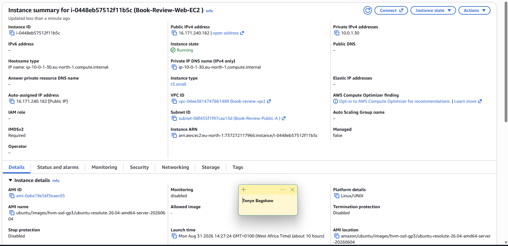
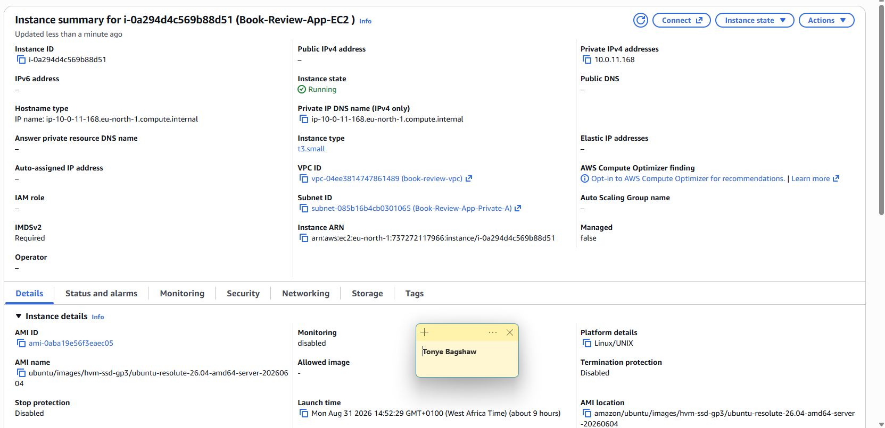
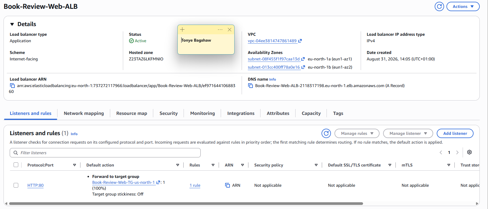
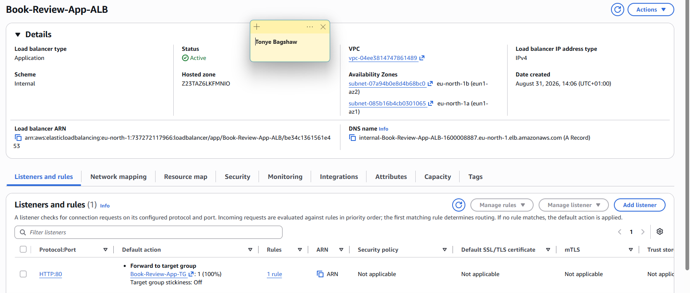
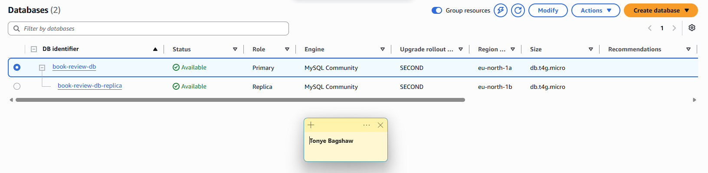
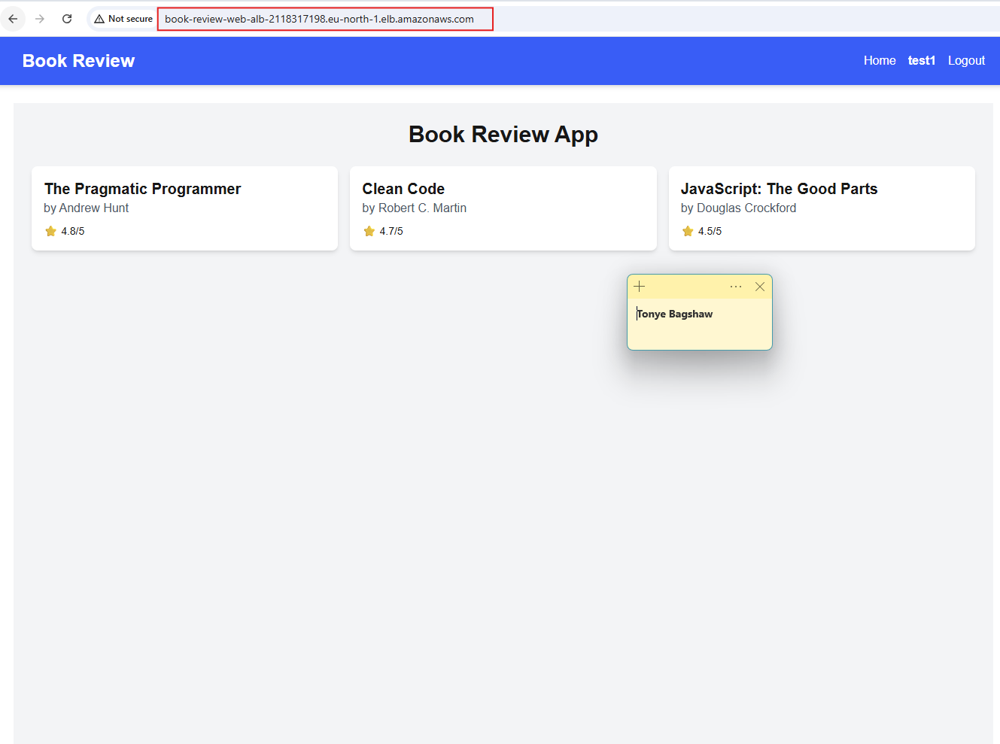
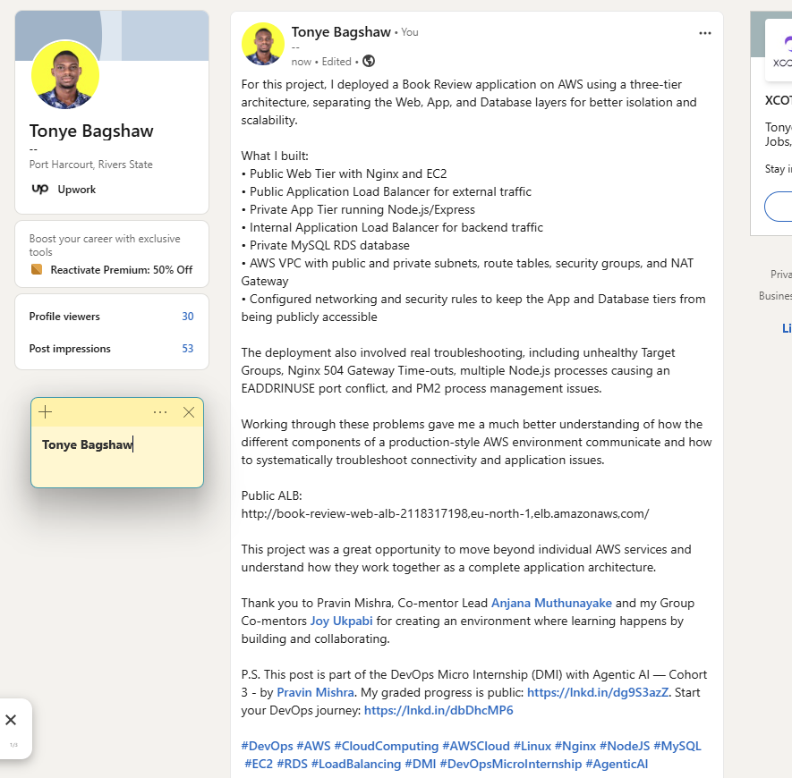

# Assignment 6 — Capstone Assignment — Deploy Book Review App (Three-Tier Architecture) on AWS

Part of the DevOps Micro Internship (DMI) with Agentic AI

---

## Purpose

This is the most important assignment of the course. You will deploy the Book Review App in a fully production-style three-tier architecture on AWS: a Next.js Web Tier behind Nginx and a public ALB, a private Node.js/Express App Tier behind an internal ALB, and a private Multi-AZ MySQL RDS database with a read replica. You are expected to design, deploy, isolate, debug, and document the result independently.

---

# Task 1 — Architecture Diagram

## Goal

Create an architecture diagram showing the custom VPC (10.0.0.0/16), the six subnets across two Availability Zones (two public Web Tier, two private App Tier, two private Database Tier), the public ALB, Web Tier EC2/Nginx, internal ALB, private App Tier EC2, private Multi-AZ RDS with its read replica, and the permitted traffic flow.

### Evidence

#### Diagram image or link

Add your diagram image or link here.

---

# Task 2 — AWS Region & Services Used

## Goal

Record the AWS Region used and list every AWS service used across networking, compute, load balancing, security, and the database.

### Notes

**Region:**

us-north-1

---

**Services:**

VPC (Virtual Private Cloud) Subnets (6 total: 2 public, 4 private) Internet Gateway Route Tables (Public + Private) EC2 Instances (2: Web Tier + App Tier) Application Load Balancer (2: Public + Internal) Security Groups (5: web-alb-sg, web-sg, internal-alb-sg, app-sg, db-sg) RDS MySQL (Single-AZ) NAT Gateway (temporary, for package installation — deleted)

---

# Task 3 — Public Entry Point

## Goal

Confirm the Book Review App loads through the public ALB DNS name.

### Evidence

#### Public ALB DNS

Paste your public ALB DNS name here:

`http://book-review-web-alb-2118317198.eu-north-1.elb.amazonaws.com/`

---

# Task 4 — Evidence Screenshots

## Goal

Capture visual proof of every tier and load balancer.

### Evidence

#### Web EC2

---

#### App EC2

---

#### Public ALB

---

#### Internal ALB

---

#### RDS + Replica

---

#### App UI proof

---

# Task 5 — Summary

## Goal

Summarize what worked in the final deployment, the issues encountered and how each was fixed, and the tools or sources used to research and debug.

### Notes

**What worked:**

The final deployment successfully connected the application components across the AWS environment. The Express backend was running on port 3001, and the backend successfully connected to the book_review_db database using SSL. Database schema updates completed successfully. Nginx was also running and serving HTTP traffic on port 80. The backend API returned HTTP/1.1 200 OK when accessed directly, confirming that the Express application was responding correctly.

---

**Issues + fixes:**

Backend Target Group was unhealthy: The backend application was running on port 3001, so the Target Group and backend networking had to be configured to allow traffic to that port.

Backend had multiple Node.js processes: Two instances of server.js were running, causing a port conflict. PM2 reported EADDRINUSE: address already in use :::3001. The manually running Node process was identified and stopped so that PM2 could manage the backend correctly.

PM2 backend entered an errored state: PM2 was repeatedly trying to start the application while port 3001 was already occupied. The conflicting process was removed and the backend was restarted under PM2.

API URL contained a duplicated path: The frontend request showed /api/api/books. This was identified as a likely API/Nginx path configuration issue requiring verification of the frontend API URL and Nginx location/proxy_pass configuration.

---

**Tools/sources used:**

AWS EC2 for instance, networking, security group, and deployment configuration.

AWS VPC for subnet route tables and NAT Gateway configuration.

AWS Target Groups / Load Balancer for backend health-check troubleshooting.

Nginx for reverse proxying and investigating the 504 Gateway Time-out.

PM2 for managing the Node.js backend process and viewing application/error logs.

Node.js / Express for the backend API.

MySQL database for the application database.

Ubuntu/Linux CLI for system and network diagnostics.

ss, lsof, ps, curl, ip route, and apt for troubleshooting processes, ports, connectivity, routing, and package updates.

Application and PM2 logs to identify the EADDRINUSE port conflict and confirm successful database connectivity.

---

# LinkedIn Post (Required)

## Goal

Publish a LinkedIn post sharing the capstone deployment, including the public ALB DNS (or a redacted screenshot), three to five lines on what you built and why it is production-style, and one proof screenshot.

## Evidence

#### LinkedIn Post URL

Paste your LinkedIn post URL here:

`https://lnkd.in/p/d4xuJVgT`

---

#### Screenshot of LinkedIn post

---

# Submission Instructions

- Add all required screenshots and links in your submission
- Do not expose passwords, RDS credentials, connection strings, private keys, or account IDs

---

# Completion Checklist

- [ ] Task 1: Architecture diagram completed
- [ ] Task 2: AWS Region and services documented
- [ ] Task 3: Public ALB DNS confirmed working
- [ ] Task 4: All six evidence screenshots captured (Web Tier, App Tier, both ALBs, RDS + replica, app UI)
- [ ] Task 5: Deployment summary completed (what worked, issues/fixes, tools/sources)
- [ ] LinkedIn post published and URL submitted
- [ ] App Tier and Database Tier confirmed not publicly accessible
- [ ] No sensitive data exposed

---

## 📌 About DMI & CloudAdvisory

DevOps Micro Internship (DMI) is a project-based DevOps program run by Pravin Mishra (The CloudAdvisory) focused on real-world execution, systems thinking, and career readiness.

It helps learners build strong DevOps foundations with hands-on experience.

---

## 📌 Resources

- 🌐 DMI Official Website: https://dmi.pravinmishra.com?utm_source=github&utm_medium=readme  
- 🎓 University: https://university.pravinmishra.com?utm_source=github&utm_medium=readme  
- 💬 Discord Community: https://discord.pravinmishra.com?utm_source=github&utm_medium=readme  
- 📝 Blog: https://dmi.pravinmishra.com/blog?utm_source=github&utm_medium=readme  
- ▶️ YouTube Playlist: https://www.youtube.com/playlist?list=PLFeSNDtI4Cho  
- 🔗 Pravin Mishra (LinkedIn): https://www.linkedin.com/in/pravin-mishra-aws-trainer/  
- 🏢 CloudAdvisory (LinkedIn): https://www.linkedin.com/company/thecloudadvisory/

---

*This submission is part of DevOps Micro Internship (DMI) — Agentic AI Track.*