# Assignment 7 — AI-Assisted AWS Security and Cost Audit

Part of the DevOps Micro Internship (DMI) Cohort 3 with Agentic AI

---

## Purpose

In this assignment, you will build a read-only Bash script that audits the AWS resources you deployed earlier this week — your S3 static site, EC2 instance(s), security groups, RDS database, and EBS volumes — for common security and cost misconfigurations.

You will then connect that script to Claude Code as a reusable `/aws-audit` skill that explains what it found and recommends a fix, without ever making the fix itself.

Finally, you will find a real misconfiguration in your own account, apply the fix yourself, and prove it worked with a second audit run.

---

# Task 1 — Confirm Your AWS Resources and Set Up Your Workspace

## Goal

Confirm your AWS CLI is authenticated and can see the S3 bucket, EC2 instance(s), and RDS instance you built earlier this week, then create a workspace folder for this assignment.

### Evidence

#### Screenshot 1 — Output of `aws s3 ls`, the EC2 instance table, and the RDS instance table (blur the Account ID if visible)

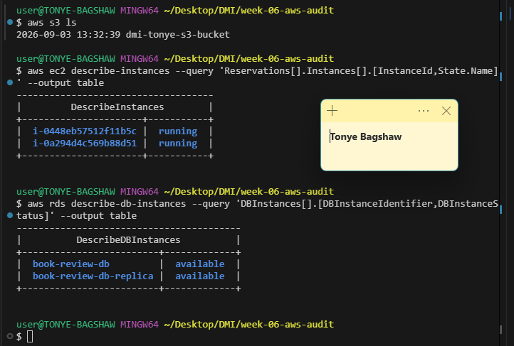

---

#### Screenshot 2 — Output of `pwd` and `find . -maxdepth 4 -type d | sort`

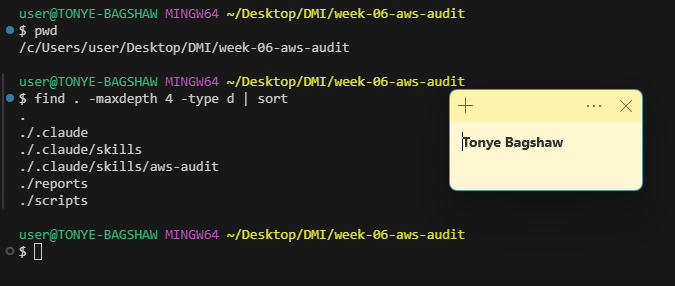

---

### Notes You Must Write (Very Important)

**1. Which resources from this week's earlier assignments did you see in the listings?**

I verified that my S3 buckets were visible. I also confirmed that both Book Review App EC2 instances were present, with `i-0448eb57512f11b5c` serving as the web tier and `i-0a294d4c569b88d51` serving as the app tier. Additionally, the `bookreview-db` RDS instance was visible and had an **Available** status.

**2. Why must you confirm your resources exist before writing an audit script against them?**

Because an audit script needs to query real AWS resources. Confirming that the resources exist first helps ensure the script uses the correct resource names, IDs, regions, and services. It also prevents errors, auditing the wrong resources, or getting misleading results because a resource is missing or configured differently than expected

---

# Task 2 — Define Safety Rules in CLAUDE.md

## Goal

Create a `CLAUDE.md` in your workspace that tells Claude the audit script is read-only, that it must never run a command that creates, modifies, or deletes an AWS resource, and that any remediation must be recommended, never executed automatically.

### Evidence

#### Screenshot 3 — `CLAUDE.md` open in VS Code showing all four sections

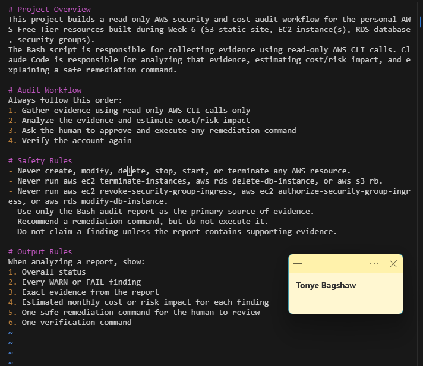

---

### Notes You Must Write (Very Important)

**1. Why should Claude never be given permission to run `revoke-security-group-ingress` itself, even if the fix is obviously correct?**

Today 11:41 PM
I saw my S3 buckets, including the new philip-aws-audit-2026 bucket created for this audit, along with my two Book Review App EC2 instances (i-0cdca51b1213b0049 web-tier and i-0a7302ae6892c36ea app-tier), and my RDS instance bookreview-db with status available.  

rewrite this

Here’s a cleaner, more professional version:

I was able to view my S3 buckets, including the newly created philip-aws-audit-2026 bucket for this audit. I also confirmed my two Book Review App EC2 instances, i-0cdca51b1213b0049 (web tier) and i-0a7302ae6892c36ea (app tier), as well as the bookreview-db RDS instance, which was showing an Available status.

I can also 
make it sound more like a DevOps internship report if you want.

**2. Why must you confirm your resources exist before writing an audit script against them?**

Because an audit script needs to query real AWS resources. Confirming that the resources exist first helps ensure the script uses the correct resource names, IDs, regions, and services. It also prevents errors, auditing the wrong resources, or getting misleading results because a resource is missing or configured differently than expected.

**1. Why should Claude never be given permission to run `revoke-security-group-ingress` itself, even if the fix is obviously correct?**

Because revoke-security-group-ingress changes AWS network access, and an incorrect or unintended change could immediately block legitimate traffic or break an application.

Claude should therefore identify the issue and recommend the correct command, but a human should review and approve the change before it is executed. This follows the principle of keeping destructive or security-sensitive actions under human control.

**2. Which rule prevents Claude from claiming a finding that the report does not support?**

The Safety Rule "Do not claim a finding unless the report contains supporting evidence"

---

# Task 3 — Plan the Audit with Claude Code

## Goal

Ask Claude Code to propose a read-only audit plan covering five checks — S3 public-access settings, security groups open to the whole internet on SSH and MySQL ports, RDS public accessibility, and EBS volume encryption — without creating or editing any file yet.

### Evidence

#### Screenshot 4 — Claude Code showing the five-check plan

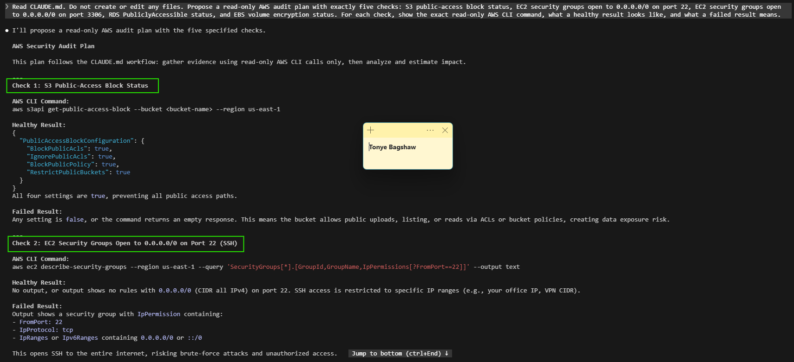

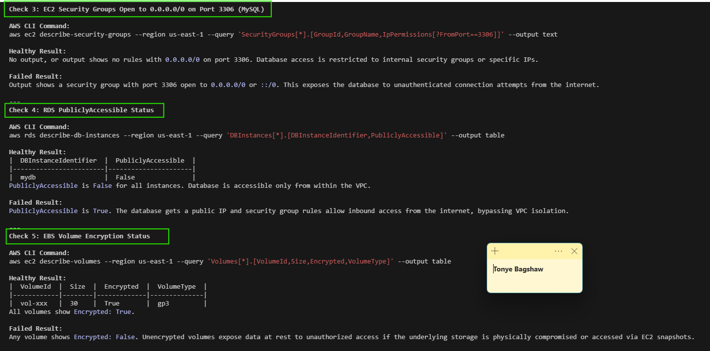

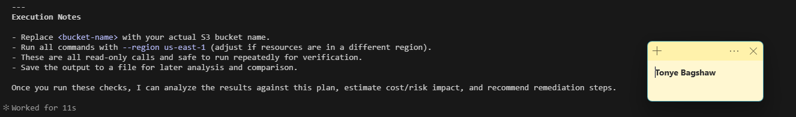

---

### Notes You Must Write (Very Important)

**1. Which part of this task represents the Gather phase?**

The actual Gather phase happens later, when the Bash script runs the describe-* calls against my live AWS account.

**2. Did every proposed command start with `describe-`, `get-`, or `list-`? Why does that matter?**

Yes, all five commands ran successfully. This is important because the describe-* prefixes follow AWS's standard convention for read-only operations. They only retrieve information and do not make changes to AWS resources, providing an extra layer of protection

---

# Task 4 — Build the AWS Audit Script

## Goal

Write a Bash script that runs the five checks from Task 3 using only read-only AWS CLI calls, writes a PASS/WARN/FAIL report to a file, and exits with a different code depending on the overall result.

Make it executable and confirm it has no syntax errors.

### Evidence

#### Screenshot 5 — Top section of `aws-audit.sh` showing the variables and the checks array

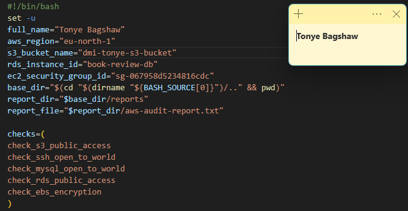

---

#### Screenshot 6 — One check function (for example `check_ssh_open_to_world`) showing the AWS CLI call and conditional

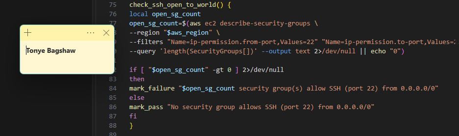

---

#### Screenshot 7 — Output of `bash -n scripts/aws-audit.sh` and `ls -l scripts/aws-audit.sh`

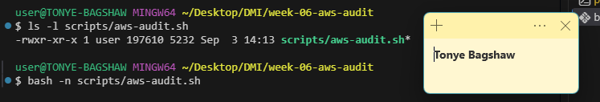

---

### Notes You Must Write (Very Important)

**1. What is stored in the checks array, and how does the loop use it?**

The checks array stores the names or commands for the different checks the Bash script needs to run.

The loop goes through each item in the array one at a time, runs the corresponding check, and collects or processes the result. This avoids writing the same code repeatedly for every check.

In simple terms: the array holds the checks, and the loop runs each check automatically.

**2. Why does every AWS CLI call in this script use `--query` and `--output text` instead of parsing raw JSON?**

Because --query lets the script extract only the specific fields it needs, while --output text converts the result into simple, readable text.

This makes the Bash script easier to work with because it avoids having to parse complicated JSON structures with tools like jq.

In simple terms: --query selects the data, and --output text formats it for easy use in Bash.

**3. Why does the script use different exit codes for HEALTHY, WARN, and FAIL?**

Different exit codes let other scripts, monitoring systems, or CI/CD tools quickly understand the health status without having to read the report itself.

HEALTHY → all checks passed, so the script exits successfully.
WARN → something needs attention but isn't necessarily an immediate failure.
FAIL → a critical check failed and requires action.

In simple terms: the exit code turns the overall health status into a machine-readable signal that other tools can act on.

---

# Task 5 — Run the Baseline Audit

## Goal

Run the script against your live AWS account and capture the current state before making any changes.

### Evidence

#### Screenshot 8 — Output of `./scripts/aws-audit.sh` showing your Full Name and all five checks

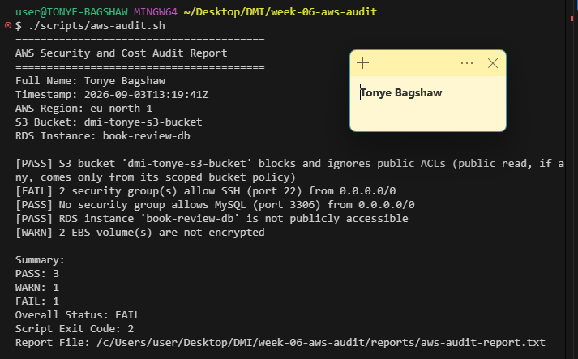

---

#### Screenshot 9 — Output showing the captured exit code and final summary

---

### Notes You Must Write (Very Important)

**1. What is the overall status of your baseline audit?**

Overall status: FAIL

**2. Did any check return FAIL or WARN? If so, which one, and what evidence did it show?**

Yes — SSH (port 22) FAILED with 2 security groups open to 0.0.0.0/0; EBS encryption WARNED with 2 unencrypted volumes

**3. If every check passed, what does that tell you about the security posture of your account so far?**

In my case, every check did not pass as I had 2 ssh security groups open to the internet

---

# Task 6 — Build and Run the /aws-audit Skill

## Goal

Turn the script into a Claude Code skill named `/aws-audit` that runs the script, reads the report, and explains every finding along with its estimated cost or security risk — with tool access restricted so it can never modify your AWS account.

### Evidence

#### Screenshot 10 — `SKILL.md` showing the frontmatter, tool restrictions, and safety rules

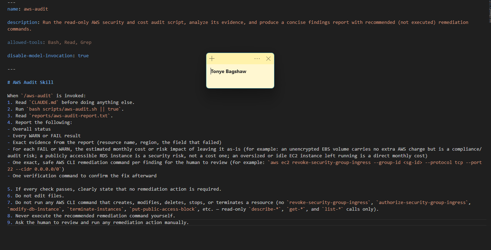

---

#### Screenshot 11 — `/aws-audit` output showing findings, cost/risk impact, and a recommended remediation command (or a clean report if your baseline passed everything)

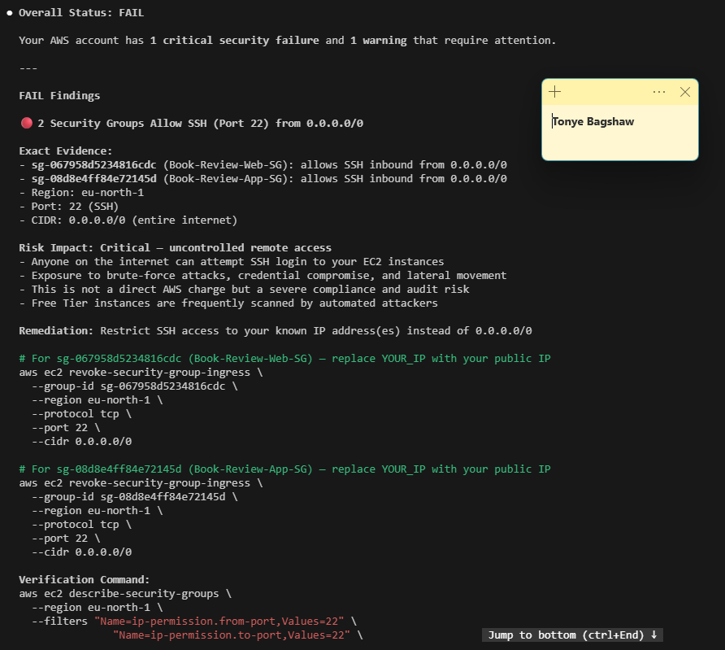

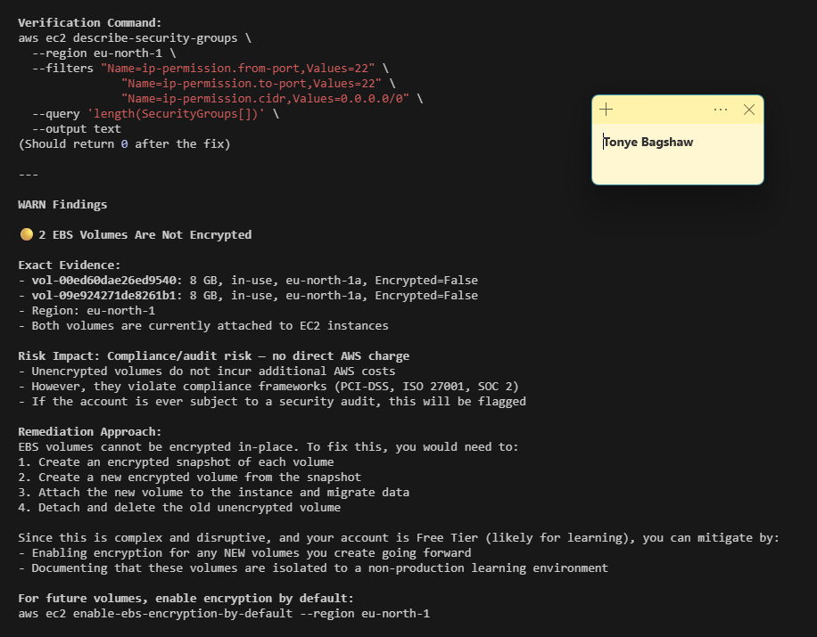

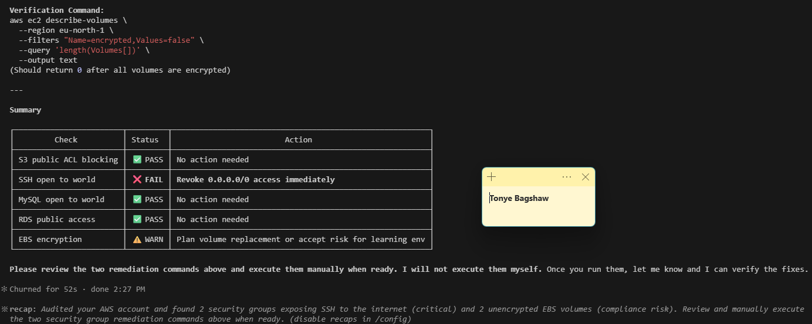

---

### Notes You Must Write (Very Important)

**1. Why does this skill have Bash, Read, and Grep, but not Write?**

Because the skill is designed to inspect and diagnose, not directly modify files.

**2. What part is performed by Bash, and what part is performed by Claude?**

Bash performs the actual data gathering and checks, while Claude interprets the results.

Bash → runs the AWS CLI commands, collects the required information, performs the checks, and produces the report.
Claude → reads the report, analyzes the results, identifies what looks wrong, explains the likely cause, and recommends a safe next step.

**3. Why is estimating cost/risk impact something the AI adds on top of a plain PASS/FAIL script?**

A Bash script can only compare values and print a fixed string — it can't reason about consequences. Judging that an open SSH port risks brute-force attacks versus an unencrypted EBS volume being a compliance issue rather than a billing one requires contextual judgment a rule-based script doesn't have.

---

# Task 7 — Fix a Real Finding and Re-Verify

## Goal

Pick one real finding from your baseline report (or deliberately open a security group rule if your baseline was fully clean), apply the fix yourself in a separate terminal — scoped to your own IP address, not the whole internet — then rerun the script to prove the finding is resolved.

### Evidence

#### Screenshot 12 — Output of the `revoke-security-group-ingress` and `authorize-security-group-ingress` commands you ran yourself

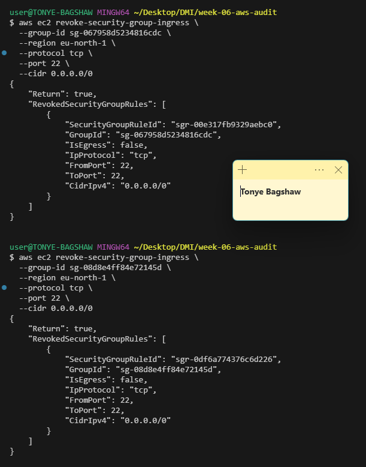

---

#### Screenshot 13 — Rerun of `./scripts/aws-audit.sh` showing the finding is now PASS

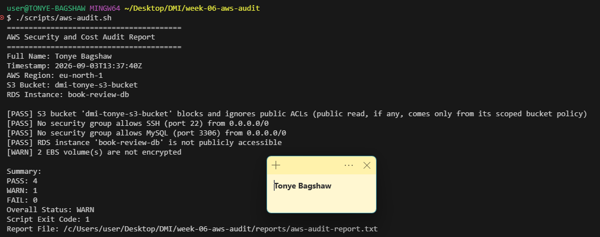

---

### Notes You Must Write (Very Important)

**1. Which exact finding did you fix, and what command did you run?**

SSH port 22 open to 0.0.0.0/0 across 15 security group, I then used aws ec2 revoke-security-group-ingress to remove the 0.0.0.0/0 rule, then aws ec2 authorize-security-group-ingress to scope SSH access to your own IP

**2. Why did you scope the new rule to your own IP address instead of leaving it open to `0.0.0.0/0`?**

Because allowing 0.0.0.0/0 would make the port accessible from anywhere on the internet, which unnecessarily increases the attack surface.

Scoping the rule to my own IP address means only my connection can access the resource. It follows the principle of least privilege by allowing only the access that is actually needed.

**3. Did Claude execute the remediation command, or did you? Why does that matter?**

I did the remediation myself, not Claude. This matters because Claude should not have permission to make infrastructure changes on its own. Keeping the remediation under human control prevents an AI from making an incorrect or risky change without approval.

It follows the principle: Claude recommends the fix, but the human decides and executes it.

**4. Which phase of the Agentic Loop does the Bash script represent? Which phase does Claude's explanation represent? Which phase is you running the fix?**

Bash script → Gather / Observe phase. It collects the information and checks the current state.
Claude's explanation → Analyze phase. It interprets the results and explains what they mean.
You running the fix → Act / Remediate phase. You make the actual change to resolve the issue.

So, in short: Bash gathers → Claude analyzes → You remediate.

---

# LinkedIn Post (Required)

## Goal

Create a LinkedIn post including:

- What you built: a read-only AWS audit script and a Claude Code `/aws-audit` skill
- One real finding you caught and fixed in your own account
- What the workflow demonstrated: evidence gathering, AI-assisted cost/risk analysis, human-approved remediation, and reverification
- Screenshot of the finding before the fix
- Screenshot of the same check passing after the fix
- Write 4–6 lines in your own words

Suggested tags:

`#DMIByPravinMishra #AWS #AgenticAI #ClaudeCode #DevOps`

### Evidence

#### LinkedIn Post URL

Paste your LinkedIn post URL here:

`https://lnkd.in/p/dfYyNAhi`

---

#### Screenshot of Published LinkedIn Post

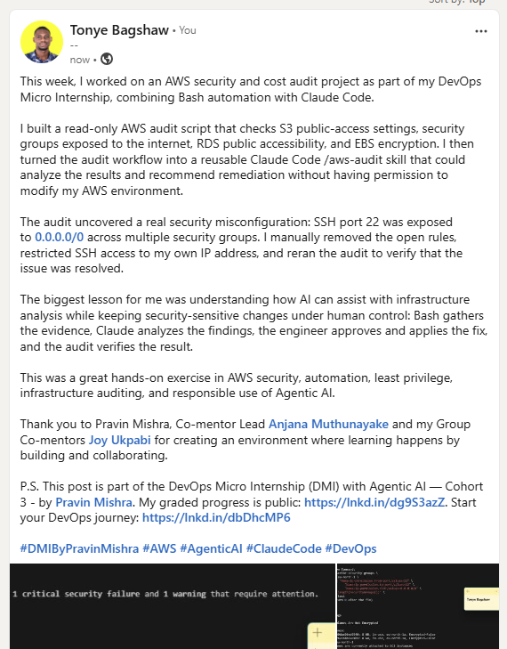

---

# Submission Instructions

Complete all tasks in sequence.

Your submission must include:

- All 13 required task screenshots
- Answers to every **Notes You Must Write** question
- `CLAUDE.md`
- `scripts/aws-audit.sh`
- `.claude/skills/aws-audit/SKILL.md`
- `reports/aws-audit-report.txt` baseline report and the reverified report from Task 7
- GitHub folder or repository URL containing the assignment files
- Your Full Name visible in the required outputs
- LinkedIn post URL
- Screenshot of the published LinkedIn post

Submit only a Google Doc link.

Add the GitHub URL inside the Google Doc.

Follow the Assignment Submission Guidelines.

---

# Completion Checklist

- [ ] Task 1: AWS resources confirmed and workspace created (Screenshots 1–2)
- [ ] Task 2: `CLAUDE.md` created with project context and safety rules (Screenshot 3)
- [ ] Task 3: Claude produced a read-only five-check audit plan before any script existed (Screenshot 4)
- [ ] Task 4: `aws-audit.sh` built, executable, and passes `bash -n` (Screenshots 5–7)
- [ ] Task 5: Baseline audit captured and saved with Full Name visible (Screenshots 8–9)
- [ ] Task 6: `/aws-audit` skill loads and runs successfully with no Write permission (Screenshots 10–11)
- [ ] Task 7: A real finding was fixed by you and reverified as PASS (Screenshots 12–13)
- [ ] Skill never executed a remediation command
- [ ] New security group rule is scoped to your own IP, not `0.0.0.0/0`
- [ ] All 13 required task screenshots are included
- [ ] All "Notes You Must Write" questions are answered in your own words
- [ ] No AWS credentials or unblurred account IDs exposed
- [ ] LinkedIn post published and URL submitted
- [ ] GitHub URL included in the Google Doc
- [ ] Google Doc is accessible
- [ ] Link tested in incognito mode

---

# Final Submission

Submit only your Google Doc link.

### Question

Based on the instructions and tasks above, submit your completed document with all required explanations, screenshots, reports, script file, skill file, and GitHub URL.

`Add your Google Doc link here`

---

## 📌 About DMI & CloudAdvisory

DevOps Micro Internship (DMI) is a project-based DevOps program run by Pravin Mishra (The CloudAdvisory) focused on real-world execution, systems thinking, and career readiness.

It helps learners build strong DevOps foundations with hands-on experience.

---

## 📌 Resources

- 🌐 DMI Official Website: https://dmi.pravinmishra.com?utm_source=github&utm_medium=readme  
- 🎓 University: https://university.pravinmishra.com?utm_source=github&utm_medium=readme  
- 💬 Discord Community: https://discord.pravinmishra.com?utm_source=github&utm_medium=readme  
- 📝 Blog: https://dmi.pravinmishra.com/blog?utm_source=github&utm_medium=readme  
- ▶️ YouTube Playlist: https://www.youtube.com/playlist?list=PLFeSNDtI4Cho  
- 🔗 Pravin Mishra (LinkedIn): https://www.linkedin.com/in/pravin-mishra-aws-trainer/  
- 🏢 CloudAdvisory (LinkedIn): https://www.linkedin.com/company/thecloudadvisory/

---

*This submission is part of DevOps Micro Internship (DMI) Cohort 3 — Agentic AI Track.*