# Assignment 6 — Capstone: Deploy Book Review App (Three-Tier Architecture) on Azure

Part of the DevOps Micro Internship (DMI) Cohort 3 with Agentic AI

---

## Purpose

This is the most important assignment of the course. You will deploy the Book Review App in a production-ready, best-practice-compliant three-tier architecture on Azure: separated presentation, application, and database tiers, least-privilege network access, a controlled public entry point, protected secrets, and availability/monitoring evidence.

---

# Task 1 — Design the Azure Three-Tier Architecture

## Goal

Create an architecture diagram and implementation plan identifying the presentation, application, and database components, the chosen Azure services, the public entry point, and the internal traffic paths.

### Evidence

#### Screenshot 1 — Architecture diagram showing the public entry point, three tiers, network boundaries, and traffic flow

---

#### Screenshot 2 — Written architecture assumptions and selected Azure services

Region and Naming
The entire architecture is deployed in a single Azure region, avoiding the latency and cost overhead of cross-region traffic. Every resource and subnet follows a consistent -bookreview naming suffix, so each component's role is identifiable from its name alone, without needing to cross-reference documentation.

Public Entry Point
An Azure Standard Load Balancer (public-facing) is the sole resource exposed to the internet. It receives all inbound HTTP traffic and forwards it to the web tier VM on port 80 — no other component in the stack is directly reachable from outside the virtual network.

Web Tier
A single Ubuntu VM runs Nginx alongside a Next.js frontend. Nginx serves the site's static and rendered content directly, and reverse-proxies any request under /api/ to the application tier over the private network. Since the app tier has no public IP and is unreachable from the browser, this proxy is the only path by which client requests reach the backend.

Application Tier
A single Ubuntu VM runs the Node.js/Express backend on port 3001. It has no public IP address, and its network access is restricted to inbound traffic from the web subnet on the API port, plus SSH access for management through a jump host.

Database Tier
Azure Database for MySQL Flexible Server is deployed with private access via VNet integration, with public network access disabled entirely. Only the application subnet is permitted to connect to it.

Secrets Management
The database admin password and the backend's JWT secret are both generated and stored in Azure Key Vault, then retrieved onto the VMs via the Azure CLI when environment files are written. Neither secret is ever typed by hand into a file that could be screenshotted or accidentally committed to source control.

Monitoring
A single Log Analytics Workspace centralizes diagnostics from both VMs, the Load Balancer, Key Vault, and the MySQL server. One alert rule tracks VM CPU usage.

Availability
Each tier runs on a single Standard_B1s VM rather than a scale set, reflecting the cost constraints of a student/free-tier subscription. This is a deliberate, documented trade-off rather than an oversight — the Task 8 availability test is scoped accordingly, demonstrating that the Load Balancer correctly detects and reacts to a VM outage, rather than proving zero-downtime failover.

Backup and Recovery
Azure Database for MySQL Flexible Server's automatic daily backups, with the default 7-day retention window, are used as-is with no additional configuration required.

---

# Task 2 — Create the Azure Network Foundation

## Goal

Create a dedicated Resource Group and VNet with separate subnets for the web, application, and database tiers, keeping the application and database tiers without direct public access.

### Evidence

#### Screenshot 3 — Resource Group overview showing the assignment resources

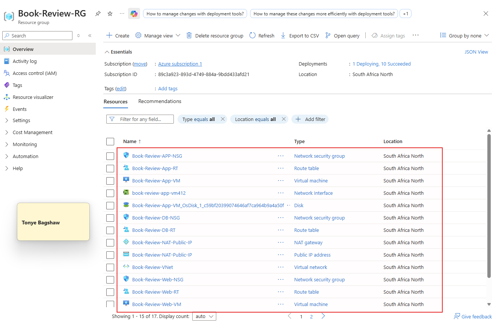

---

#### Screenshot 4 — VNet overview showing the address space and all required subnets

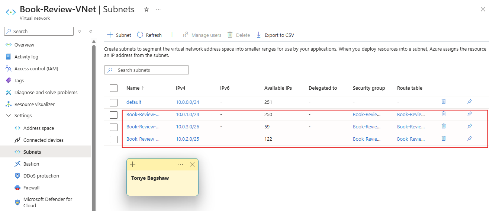

---

#### Screenshot 5 — Route-table or Private DNS evidence where applicable

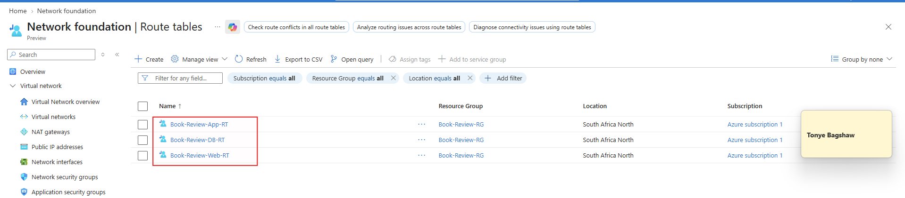

---

# Task 3 — Configure Security and Secret Management

## Goal

Apply least-privilege NSG rules so traffic flows Internet → public entry point → web tier → application tier → database tier, and store credentials in Azure Key Vault or another approved secure mechanism.

### Evidence

#### Screenshot 6 — NSG rules proving least-privilege access between the tiers

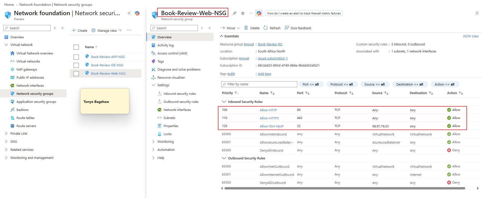

---

#### Screenshot 7 — Key Vault or approved secret-management configuration (without displaying secret values)

---

# Task 4 — Deploy the Presentation (Web) Tier

## Goal

Deploy the Book Review App presentation layer on the approved web-tier compute service, configured to route requests to the internal application-tier endpoint, and not directly exposed except through the public entry service.

### Evidence

#### Screenshot 8 — Web-tier compute overview showing subnet and availability configuration

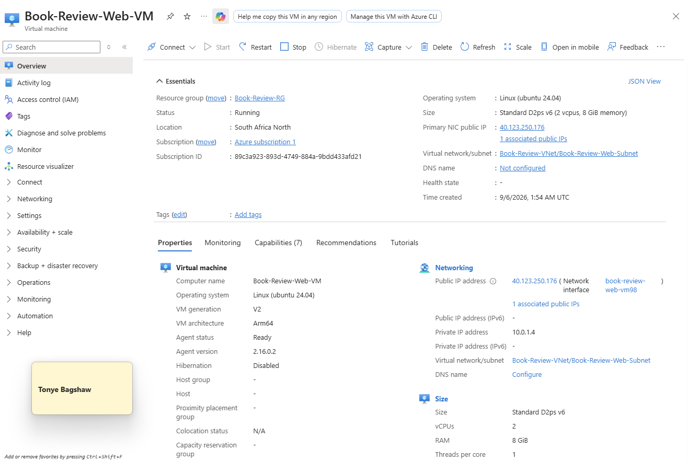

---

#### Screenshot 9 — Terminal or service output proving the presentation layer is running

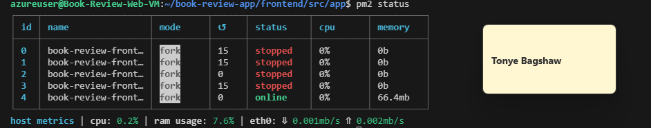

---

# Task 5 — Deploy the Business (Application) Tier

## Goal

Deploy the Book Review App backend privately in the application subnet, configured to use the private database endpoint and secured environment values, reachable only through its internal endpoint.

### Evidence

#### Screenshot 10 — Application-tier compute overview showing private subnet placement

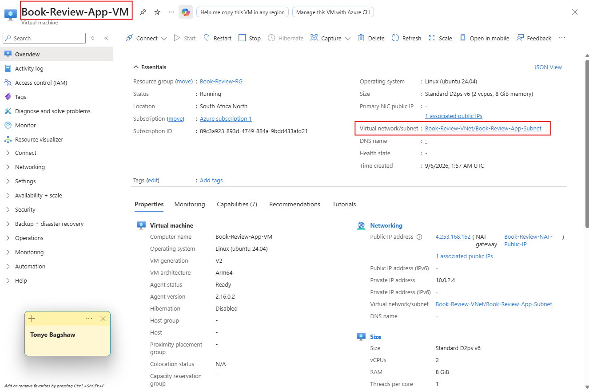

---

#### Screenshot 11 — Backend process, service, or listening-port evidence

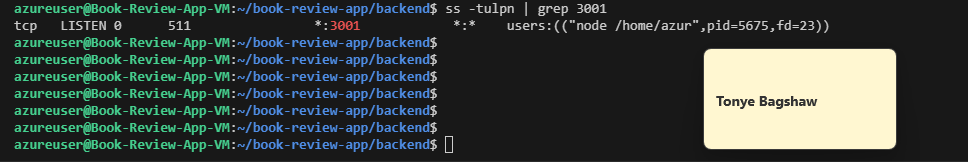

---

#### Screenshot 12 — Internal health-check or API response (without exposing secrets)

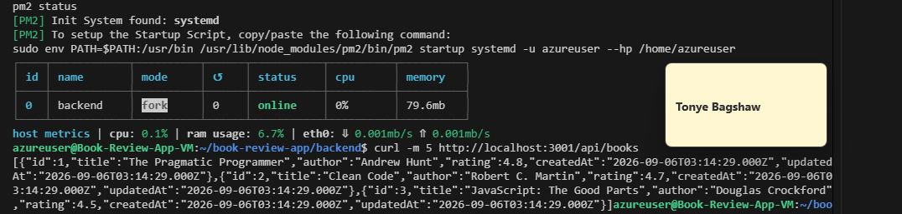

---

# Task 6 — Deploy the Managed Database Tier

## Goal

Create a private Azure managed database (public access disabled), with availability/backup/retention settings, the Book Review App schema imported, and access restricted to the application tier only.

### Evidence

#### Screenshot 13 — Database overview showing private connectivity and public access disabled

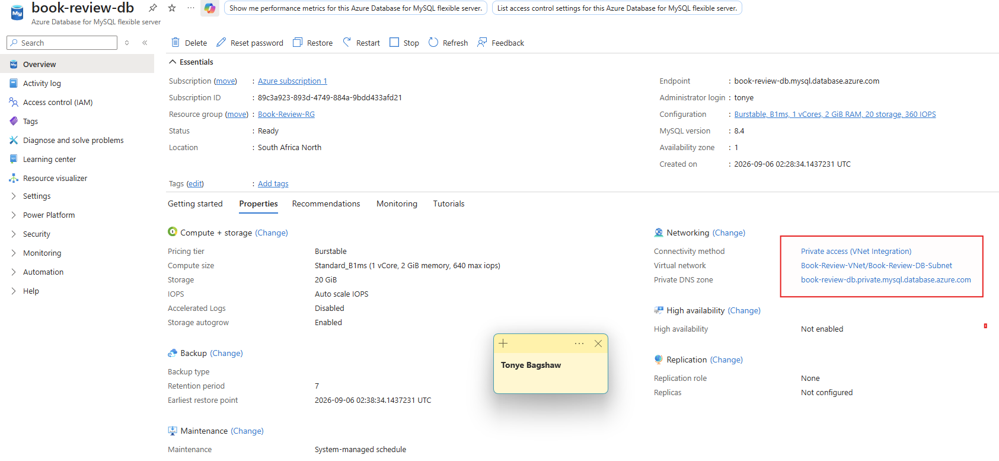

---

#### Screenshot 14 — Availability, backup, and retention configuration

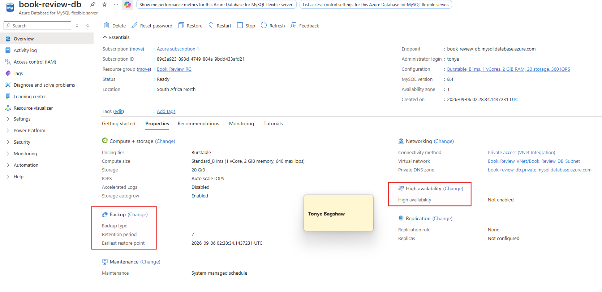

---

#### Screenshot 15 — Successful schema or connectivity verification (without exposing credentials)

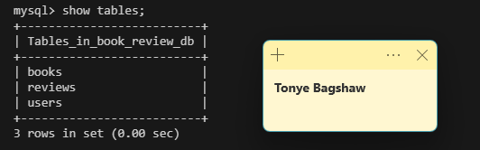

---

# Task 7 — Configure Traffic Management, Availability, and Monitoring

## Goal

Configure the approved public entry service with health probes and backend pools, internal routing for the application tier where required, and enable Azure Monitor/diagnostics/logs/alerts for the key resources.

### Evidence

#### Screenshot 16 — Public entry service showing listener, frontend endpoint, and healthy web targets

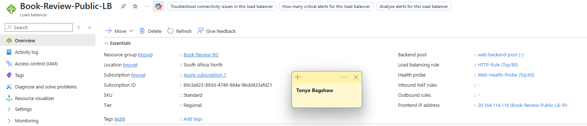

---

#### Screenshot 17 — Internal application-tier load-balancing or routing configuration where applicable

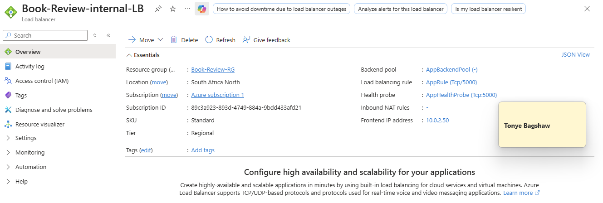

---

#### Screenshot 18 — Azure Monitor, diagnostic settings, logs, metrics, or alert evidence

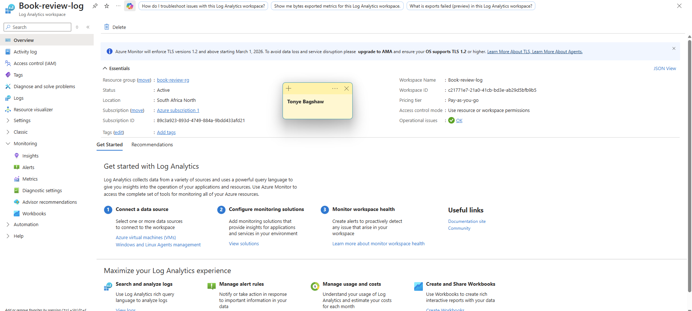

---

# Task 8 — Validate the Production-Style Deployment

## Goal

Confirm the Book Review App works end to end through the public endpoint, with at least one database read and one write, confirm private tiers are not internet-reachable, and complete a safe availability test.

### Evidence

#### Screenshot 19 — Browser showing the Book Review App through the public endpoint

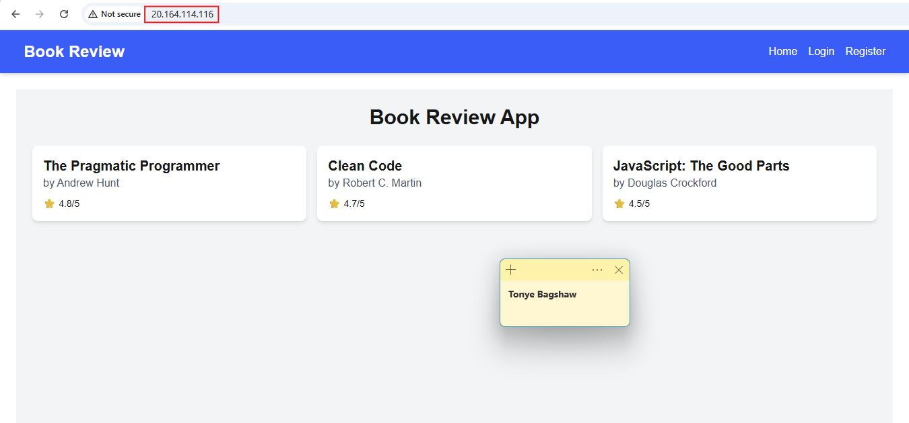

---

#### Screenshot 20 — Proof of successful database-backed read and write operations

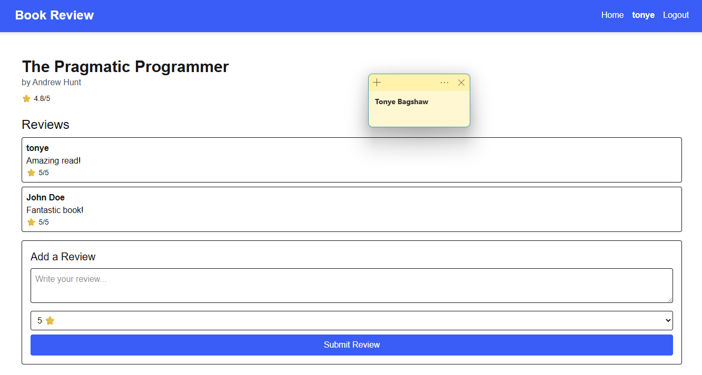

---

#### Screenshot 21 — Evidence that private tiers are not publicly accessible

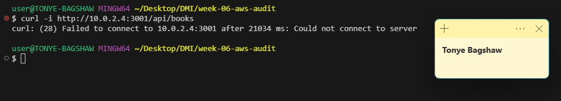

---

#### Screenshot 22 — Availability-test and healthy-target evidence

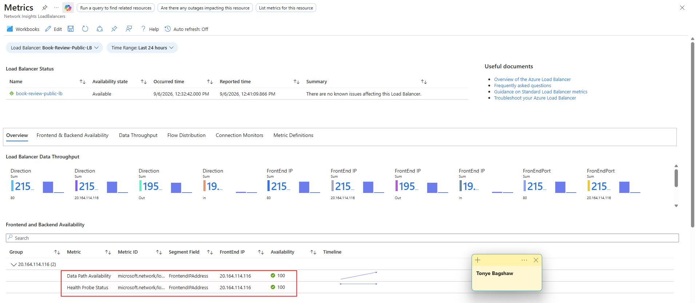

---

#### Public Endpoint

Paste your public endpoint URL here:

`http://20.164.114.116/`

---

### Notes

Summarize what worked, issues encountered and how they were fixed, and the availability/security/secrets/monitoring/backup choices made.

What worked

The backend VM was running correctly.
PM2 confirmed the backend was online.
Node.js was listening on port 3001 on all interfaces.
The frontend API path was corrected from /api/api/books to /api/books.
Nginx was correctly configured as the reverse proxy.
UFW on the App VM was checked and found inactive.
Network troubleshooting with curl, nc, tcpdump, ip addr, and ip route helped identify the IP addressing issue.
The App VM's actual private IP was confirmed as 10.0.2.4.
10.0.2.50 was confirmed to be the Internal Load Balancer's private IP.

Issues encountered and fixes

Frontend was requesting /api/api/books.
Fix: Changed the frontend request to use /books while keeping NEXT_PUBLIC_API_URL=/api.
Frontend initially had a Next.js startup problem.
Fix: Installed the required dependencies, rebuilt the application, and restarted it with PM2.
Backend initially could not connect to Azure MySQL.
Cause: Azure MySQL requires secure transport.
Fix: The database connection needs to use TLS/SSL.
Web VM received 504 Gateway Timeout for /api/books.
Cause: Nginx could not successfully reach the upstream.
The App VM was initially assumed to be 10.0.2.50.
Fix: Network inspection showed the App VM is actually 10.0.2.4, while 10.0.2.50 is the Internal Load Balancer.
Direct traffic to 10.0.2.4:3001 worked.
This confirmed the Node.js application and App VM were functioning correctly.
Because 10.0.2.50 is the Internal Load Balancer, Nginx should use the ILB address when the ILB is part of the intended architecture:
proxy_pass http://10.0.2.50:3001;

---

# Submission Instructions

- Add all required screenshots and links in your submission
- Do not expose passwords, keys, connection strings, or subscription IDs

---

# Completion Checklist

- [ ] Task 1: Architecture diagram and assumptions documented (Screenshots 1–2)
- [ ] Task 2: Network foundation created with isolated tiers (Screenshots 3–5)
- [ ] Task 3: Least-privilege security and secret management configured (Screenshots 6–7)
- [ ] Task 4: Presentation tier deployed (Screenshots 8–9)
- [ ] Task 5: Application tier deployed privately (Screenshots 10–12)
- [ ] Task 6: Managed database tier deployed privately (Screenshots 13–15)
- [ ] Task 7: Public entry, internal routing, and monitoring configured (Screenshots 16–18)
- [ ] Task 8: End-to-end validation and availability test completed (Screenshots 19–22, Public Endpoint, Notes)
- [ ] No sensitive data exposed

---

## 📌 About DMI & CloudAdvisory

DevOps Micro Internship (DMI) is a project-based DevOps program run by Pravin Mishra (The CloudAdvisory) focused on real-world execution, systems thinking, and career readiness.

It helps learners build strong DevOps foundations with hands-on experience.

---

## 📌 Resources

- 🌐 DMI Official Website: https://dmi.pravinmishra.com?utm_source=github&utm_medium=readme  
- 🎓 University: https://university.pravinmishra.com?utm_source=github&utm_medium=readme  
- 💬 Discord Community: https://discord.pravinmishra.com?utm_source=github&utm_medium=readme  
- 📝 Blog: https://dmi.pravinmishra.com/blog?utm_source=github&utm_medium=readme  
- ▶️ YouTube Playlist: https://www.youtube.com/playlist?list=PLFeSNDtI4Cho  
- 🔗 Pravin Mishra (LinkedIn): https://www.linkedin.com/in/pravin-mishra-aws-trainer/  
- 🏢 CloudAdvisory (LinkedIn): https://www.linkedin.com/company/thecloudadvisory/

---

*This submission is part of DevOps Micro Internship (DMI) Cohort 3 — Agentic AI Track.*
